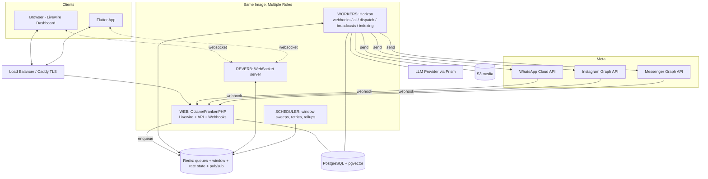
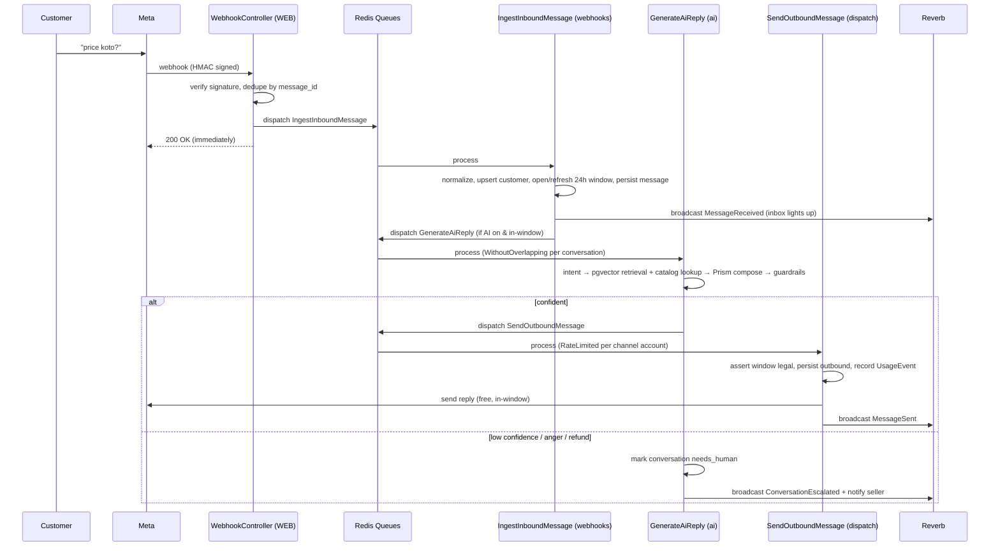
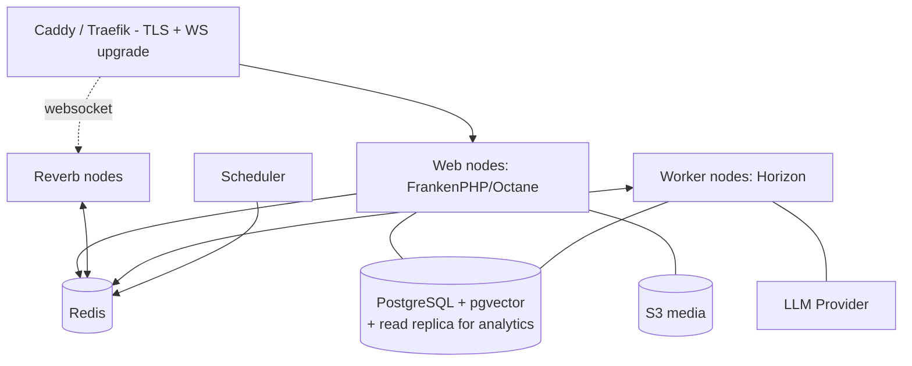

# OmniReply — Total Architecture (Laravel 13 + Livewire + PostgreSQL)

**Companion to:** OmniReply Product & Technical Spec.
**Stack decision:** Laravel (web + API + workers + websockets, one codebase), Livewire for the dashboard, PostgreSQL (with pgvector) as the single source of truth — including for RAG. No Python sidecar; the entire AI/retrieval pipeline runs in PHP.

The guiding principle of this architecture: **it is a modular monolith in code, but a multi-process system at runtime.** One repository, organized into domain modules, deployed as several process types (web, queue workers, websocket server, scheduler) that all share the same code and database. This gives you the async, burst-tolerant pipeline a messaging product needs without the operational tax of microservices — the right shape for a Laravel team.

---

## 0. Stack at a Glance (locked decisions)

| Concern | Choice | Why |
|---|---|---|
| Framework | **Laravel 13.x** (PHP 8.3/8.4) | Current stable; batteries-included for everything below |
| Web UI | **Livewire 3** + Alpine + Tailwind | Server-driven reactivity; perfect for a live inbox without an SPA |
| Mobile API | **Laravel API routes + Sanctum** (token auth) | Flutter app consumes the same services as Livewire |
| Database | **PostgreSQL 16/17 + pgvector** | Relational integrity + native vector search for RAG in one DB |
| Cache / locks / rate-state / queue backend | **Redis** | Queues, conversation-window state, rate-limit token buckets, Reverb pub/sub |
| Queues & workers | **Laravel Queues + Horizon** | Async pipeline, retries, backoff, per-queue concurrency, dashboard |
| Realtime | **Laravel Reverb + Echo** | First-party WebSocket server; horizontal scaling via Redis pub/sub; Pulse monitoring |
| Throughput / app server | **Octane + FrankenPHP** | High webhook-ingest throughput; FrankenPHP runs PHP + web server in one process |
| LLM gateway | **Prism PHP** (provider-agnostic) | One fluent API across Claude / OpenAI / Gemini / Ollama; text, structured output, embeddings, tool-calling, streaming, failover |
| Higher-level AI (optional) | **Laravel AI SDK** (built on Prism) | Agent pattern + conversation persistence; *early (v0.1.x)* — adopt selectively, keep production paths on Prism |
| Embeddings + vector search | **Prism embeddings → pgvector** | `embedding <=> :vec` ANN search, scoped per tenant |
| Object storage | **S3-compatible** (media, attachments) | Off-box binary storage |
| Auth (web) | **Fortify / Breeze** | Session auth for the dashboard |
| Multi-tenancy | **Shared DB + `workspace_id` + global scopes** (+ optional Postgres RLS) | Simple, scalable; RLS as defense-in-depth |
| Mobile | **Flutter** (Sanctum API + Reverb client + FCM push) | Live inbox in foreground, push alerts in background |
| Payments | **bKash / Nagad / SSLCommerz** (BD) via custom integrations | Local rails; usage metered via events |
| Observability | **Pulse** (prod metrics) + **Telescope** (dev) + structured logs | Queue, Reverb, request, exception visibility |
| Deploy | **Docker (FrankenPHP image)** on Forge / VPS, or **Laravel Cloud** (managed Reverb) | Same image, multiple process roles |

---

## 1. Domain Modules (bounded contexts)

One Laravel app, internally split into modules (folders under `app/Domain/...` or a packages/modules layout — your call; the boundaries matter more than the directory tool):

- **Tenancy** — workspaces, members, roles, invitations.
- **Channels** — Meta integration: WhatsApp/Instagram/Messenger drivers, webhook verification, token vault.
- **Inbox** — conversations, threading, **24-hour window tracking**, assignment, status.
- **Messaging** — canonical inbound/outbound messages, idempotency, the outbound dispatcher.
- **AI** — intent classification, RAG orchestration, guardrails, tool/function execution.
- **Knowledge** — document ingestion, chunking, embeddings, vector store (pgvector).
- **Catalog** — products, variants, stock, delivery rules.
- **Orders** — lead/order capture, payment links, stock decrement.
- **Billing** — plans, subscriptions, usage metering.
- **Analytics** — rollups, resolution rate, conversion, cost.

Each module exposes **Actions/Services** (e.g., `SendMessageAction`, `GenerateReplyAction`, `TakeOverConversationAction`) that are the *only* way other layers (Livewire components, API controllers, jobs) invoke behavior. This keeps the web UI and the Flutter API perfectly in sync — neither contains business logic.

---

## 2. Runtime Process Topology

The single most important architectural fact: **the same codebase runs as four process types.**



- **WEB** answers Meta's webhooks in milliseconds (verify → enqueue → return `200`), serves the Livewire dashboard, and serves the Sanctum API. Octane/FrankenPHP keeps the framework hot for burst webhook traffic.
- **WORKERS (Horizon)** do all the heavy, slow, or rate-limited work asynchronously.
- **REVERB** pushes live updates to the inbox (browser and Flutter).
- **SCHEDULER** runs periodic maintenance.

Run commands: `octane:frankenphp` (web), `php artisan horizon` (workers), `php artisan reverb:start` (websockets), `php artisan schedule:work` (scheduler).

---

## 3. The Async Message Pipeline (the heart)

Every inbound message flows through three queued jobs. **Webhooks are never processed inline** — that's what keeps you within Meta's webhook timeout and absorbs viral-comment bursts.



**Job responsibilities & guarantees**

1. **`IngestInboundMessage`** (queue: `webhooks`)
   - Maps the channel-specific payload to a canonical `InboundMessage` DTO.
   - Upserts the `Customer` (merging channel identities), opens/refreshes the `Conversation` and its `window_expires_at` (now + 24h) in Postgres and Redis.
   - Persists the `Message` with the Meta `message_id` as a **unique** column → natural idempotency on webhook retries.
   - Broadcasts to the inbox over Reverb.
   - Dispatches `GenerateAiReply` only if AI is enabled, the conversation is in-window, and autonomy mode allows it.

2. **`GenerateAiReply`** (queue: `ai`)
   - Uses `WithoutOverlapping(conversation_id)` middleware (Redis lock) so two messages in one conversation can't generate replies concurrently and arrive out of order.
   - **Intent classification** (Prism, cheap/fast model).
   - **Grounding retrieval** — *hybrid and deliberate*: structured facts (price, stock, delivery charge) come from **relational queries on the catalog**, never from vectors; unstructured context (policies, FAQ, descriptions) comes from **pgvector similarity search** scoped to the workspace. This split is the core anti-hallucination guarantee.
   - **Compose** with Prism, exposing **tools/function-calling**: `create_order`, `generate_payment_link`, `escalate_to_human`, `schedule_followup`.
   - **Guardrails**: confidence threshold, allowed-action whitelist, policy validation, anger/refund detection. Below threshold → escalate.
   - Records token usage (`UsageEvent`).

3. **`SendOutboundMessage`** (queue: `dispatch`)
   - `RateLimited(channel_account)` middleware backed by a Redis token bucket (e.g., Instagram's ~200/hour). Over limit → `release($delay)` to retry later instead of failing.
   - Re-checks **window legality** via the Inbox service before every send. **Never applies the Human Agent tag to AI messages** (Meta-prohibited; hard-coded block).
   - Calls the channel driver's `send()`, persists the outbound `Message`, broadcasts, meters.

All three jobs are safe to retry (Horizon backoff); idempotency keys prevent double-sends.

---

## 4. Channel Integration Layer (driver pattern)

A `ChannelManager` (Laravel Manager pattern) resolves a driver by channel type. Each driver implements one contract, so the rest of the system is channel-agnostic.

```php
interface ChannelDriver
{
    public function verifyWebhook(Request $request): bool;        // HMAC X-Hub-Signature-256
    public function parseInbound(array $payload): array;          // -> InboundMessage DTOs
    public function send(Channel $channel, OutboundMessage $msg): SendResult;
    public function sendTemplate(Channel $channel, TemplateMessage $tpl): SendResult; // out-of-window
    public function windowRules(Conversation $c): WindowPolicy;    // is a free reply allowed right now?
}
```

Implementations: `WhatsAppCloudDriver`, `InstagramDriver`, `MessengerDriver`.

- **Transport**: Laravel HTTP client (`Http::withToken(...)->retry(...)->timeout(...)`) to the Graph API, with a per-account circuit breaker so one seller's token problems don't cascade.
- **Token vault**: `channels.access_token` uses the `encrypted` cast; a scheduled job refreshes long-lived tokens before expiry.
- **Webhook signature verification** lives in middleware on the webhook route group.
- **Comment-to-DM** arrives as a distinct inbound event type and enters the same pipeline with a "public reply + private DM" action.

---

## 5. AI & RAG Layer (Prism + pgvector, all in PHP)

**Prism PHP** is the provider-agnostic gateway. You configure providers in config and swap models without touching call sites.

- `Prism::text()` — reply generation.
- `Prism::structured()` with an `ObjectSchema` — deterministic **order-capture slot-filling** (product → variant → qty → name → phone → address) returned as typed data.
- `Prism::embeddings()` — embed knowledge chunks and queries.
- **Tools / function-calling** — the AI's actions (`create_order`, etc.), each validated server-side against an allow-list.
- **Provider routing & failover** — cheap model for intent, stronger model for generation; configure a fallback provider so a single provider outage degrades gracefully.

**RAG with pgvector**

```sql
CREATE EXTENSION IF NOT EXISTS vector;

CREATE TABLE kb_chunks (
    id            BIGINT GENERATED ALWAYS AS IDENTITY PRIMARY KEY,
    workspace_id  UUID NOT NULL,
    document_id   UUID NOT NULL,
    content       TEXT NOT NULL,
    embedding     vector(1536) NOT NULL,           -- match your embedding model's dimension
    created_at    TIMESTAMPTZ DEFAULT now()
);

-- ANN index for fast similarity search
CREATE INDEX kb_chunks_embedding_hnsw
    ON kb_chunks USING hnsw (embedding vector_cosine_ops);

CREATE INDEX kb_chunks_workspace ON kb_chunks (workspace_id);
```

Retrieval (always tenant-scoped):

```sql
SELECT id, content
FROM kb_chunks
WHERE workspace_id = :workspace_id
ORDER BY embedding <=> :query_vector     -- cosine distance
LIMIT 6;
```

- **Indexing** is a job: `IndexKnowledge` (queue: `indexing`) embeds chunks in batches via Prism and stores vectors. Re-runs when a seller edits FAQ/policies; a catalog change triggers re-index of affected product descriptions.
- **Prices/stock are NOT vectorized** — they're read live from `products` so the AI can never quote a stale or hallucinated number.
- **Optional**: the first-party Laravel AI SDK (built on Prism, requires Postgres+pgvector for its vector store) gives an Agent pattern and conversation persistence. It's early (v0.1.x), so keep production-critical generation on Prism directly and adopt SDK conveniences as they harden.

**Cost & quality controls**: per-workspace token metering, response caching for identical FAQ hits, intent short-circuit to canned answers for exact matches, and the confidence-based handoff.

---

## 6. Realtime Inbox (Livewire + Reverb)

Livewire 3 components — `ConversationList`, `ConversationThread`, `Composer` — subscribe to **Echo** private channels and update in place when the server broadcasts.

- Channels: `workspace.{id}.inbox` (new conversations/escalations) and `conversation.{id}` (per-thread messages). Authorized via gates tied to workspace membership/role.
- Broadcast events: `MessageReceived`, `MessageSent`, `AiReplied`, `ConversationEscalated`.
- Reverb scales horizontally over Redis pub/sub; monitor connections with Pulse; on Forge, enable the Reverb optimization to raise connection limits.
- `wire:poll` as a low-frequency fallback if a socket drops.
- Optional presence channels for "agent online / typing".

Livewire listener sketch:

```php
// ConversationThread.php
public function getListeners(): array
{
    return ["echo-private:conversation.{$this->conversationId},MessageSent" => 'appendMessage'];
}
```

---

## 7. Database Architecture (PostgreSQL)

**Multi-tenancy** — shared database, shared schema, `workspace_id` on every tenant-scoped table.

- A `BelongsToWorkspace` trait adds a **global Eloquent scope** bound to the current workspace (resolved from auth for web, from the Sanctum token for API, set explicitly on each job). This makes cross-tenant leakage the exception path, not the default.
- **Defense-in-depth (optional, recommended for the agency/self-hosted edition):** Postgres **Row-Level Security**. Set a session GUC per request/job and let the DB enforce isolation even if a query forgets the scope.

```sql
ALTER TABLE conversations ENABLE ROW LEVEL SECURITY;

CREATE POLICY tenant_isolation ON conversations
USING (workspace_id = current_setting('app.current_workspace')::uuid);
```
```php
// set once per request/job before queries
DB::statement("SET app.current_workspace = ?", [$workspaceId]);
```

**Postgres-specific design choices**

- **Primary keys: ULIDs** (`HasUlids`) on write-heavy tables (messages, usage_events) — time-ordered, better index locality than random UUIDs; UUIDs elsewhere are fine.
- **JSONB** for flexible fields: `customers.channel_identities`, `products.variants`, `messages.attachments`, `ai_configs.bargain_policy`, raw webhook snapshots. GIN-index the ones you query.
- **Partitioning**: range-partition `messages` (and likely `usage_events`) by month once volume grows — these are the hot, ever-growing tables.

```sql
CREATE TABLE messages (
    id            UUID NOT NULL,
    workspace_id  UUID NOT NULL,
    conversation_id UUID NOT NULL,
    direction     TEXT NOT NULL,        -- in | out
    author        TEXT NOT NULL,        -- customer | ai | agent
    body          TEXT,
    lang          TEXT,
    external_id   TEXT,                 -- Meta message id (idempotency)
    created_at    TIMESTAMPTZ NOT NULL DEFAULT now()
) PARTITION BY RANGE (created_at);

CREATE UNIQUE INDEX messages_external_id_uq ON messages (external_id);
CREATE INDEX messages_conversation ON messages (conversation_id, created_at DESC);
```

- **Transactional integrity**: order creation + stock decrement in a single transaction with `->lockForUpdate()` on the product row to prevent overselling under concurrency.
- **Key indexes**: `conversations (workspace_id, status, window_expires_at)`, `customers` GIN on `channel_identities`, `products (workspace_id)` + trigram on `name` for search.

**Core tables**: `workspaces`, `users`, `workspace_user` (pivot + role), `channels`, `customers`, `conversations`, `messages`, `products`, `orders`, `order_items`, `knowledge_documents`, `kb_chunks` (vector), `ai_configs`, `message_templates`, `usage_events`. Queue/failed-job state lives in Redis/Horizon.

---

## 8. Mobile API Layer (Flutter)

- Versioned `/api/v1`, **Sanctum** personal access tokens issued on login.
- Controllers call the **same Action/Service classes** as Livewire — zero logic duplication.
- **Realtime on mobile**: Flutter connects to Reverb (Pusher-protocol compatible) via a Dart Echo/Pusher client, authorizing private channels through a Sanctum-protected `/broadcasting/auth` endpoint, **plus FCM push** for "new message / new order" alerts when the app is backgrounded. Foreground = live socket; background = push.
- API throttling via Laravel's `throttle` middleware.

---

## 9. Background Jobs & Scheduling

**Horizon supervisors**, one per queue, with concurrency tuned to the bottleneck:

| Queue | Purpose | Concurrency posture |
|---|---|---|
| `webhooks` | Ingest + normalize inbound | High; jobs are fast |
| `ai` | Intent + RAG + compose | **Bounded** by LLM throughput/cost |
| `dispatch` | Outbound sends to Meta | Bounded by per-account rate limits |
| `broadcasts` | Proactive templates (opt-in) | Low priority, heavily throttled |
| `indexing` | Embeddings / re-index | Low priority |

**Job middleware**: `WithoutOverlapping` (per conversation), `RateLimited` (per channel account), `ThrottlesExceptions` (provider hiccups).

**Scheduler tasks**: sweep expiring 24h windows (mark conversations, optionally queue compliant one-time-notification prompts), retry stuck dispatches, roll up `usage_events` into billing, prune/archive old data and partitions, refresh Meta tokens, re-embed changed catalog entries.

Poison webhooks land in `failed_jobs` with alerting; a dead-letter path quarantines repeatedly failing payloads.

---

## 10. Security & Compliance (in code)

- **Token vault**: `encrypted` casts for all Meta tokens; defined APP_KEY rotation procedure.
- **Webhook HMAC verification** middleware on every channel webhook.
- **Tenant isolation**: global scope + (optional) RLS; policy/gate checks on every Action; signed Reverb channel auth.
- **PII discipline**: store the minimum, encrypt sensitive columns, scheduled retention pruning.
- **Meta-policy enforcement is code, not documentation**: window-legality check before each send; **AI sends can never use the Human Agent tag**; opt-out suppression honored by the dispatcher; per-account rate limiting to avoid bans.
- **Idempotency**: unique external message id; idempotent send keys.
- **Secrets**: LLM keys and Meta app secrets server-side only; per-tenant tokens isolated.

---

## 11. Deployment Topology



- **One Docker image** (FrankenPHP/Octane base) launched as different roles: web, `horizon`, `reverb:start`, `schedule:work`.
- **Managed datastores**: PostgreSQL with pgvector + Redis; S3-compatible object storage; optional Postgres read replica for analytics queries.
- **Reverse proxy** terminates TLS and routes WebSocket upgrades to Reverb.
- **Scaling**: stateless web behind a load balancer; add worker nodes for `ai`/`dispatch` independently; Reverb scales via Redis pub/sub.
- **Ops options**: **Laravel Forge** (provision a VPS, one-click Reverb tuning) for control, or **Laravel Cloud** (managed Reverb clusters) to skip infra. For the **self-hosted/CodeCanyon edition**, ship a `docker-compose` plus a first-run setup wizard (env, Meta app creds, LLM key, migrations).
- **CI/CD** (GitHub Actions): build image → run Pest tests → `php artisan migrate --force` → deploy → `php artisan horizon:terminate` (graceful worker reload) and `octane:reload`.

**Octane caution**: because the framework stays in memory, never hold tenant state in singletons. Reset/scope the workspace context per request and per job, or you'll leak one tenant's data into another's response.

---

## 12. Phase-0 Build Slice (concrete, buildable)

1. Scaffold Laravel 13 + Livewire 3 + Tailwind; provision Postgres (pgvector) + Redis; wire Horizon + Reverb.
2. **Channels**: `WhatsAppCloudDriver` + `MessengerDriver`; signed webhook route; encrypted token vault. *(Start Meta Business Verification + App Review on day one — it gates launch.)*
3. **Pipeline**: `IngestInboundMessage → GenerateAiReply → SendOutboundMessage`, with the three queues and the window/rate guards.
4. **AI/RAG**: Prism wired to one provider; `kb_chunks` + HNSW; `IndexKnowledge` job; hybrid retrieval (catalog facts relational, FAQ/policy via pgvector).
5. **Inbox**: Livewire components + Reverb live updates; AI↔human toggle; basic handoff/escalation.
6. **Tenancy**: workspaces + roles via shared-DB global scope; catalog CSV import; FAQ ingest.
7. **Commerce stub**: order capture via `Prism::structured()`; bKash/Nagad payment-link integration; `UsageEvent` metering.
8. Pulse + Telescope; Pest tests on the pipeline jobs; Dockerized deploy on Forge.

---

## 13. Stack-Specific Risks & Mitigations

| Risk | Mitigation |
|---|---|
| LLM provider latency / rate limits | Bounded `ai` queue, response caching, Prism multi-provider failover, intent short-circuit |
| Long AI jobs starving workers | Dedicated `ai` queue, job timeouts, everything async |
| Reverb scaling at many concurrent inbox users | Redis pub/sub scaling, connection tuning (Forge optimization), Pulse monitoring |
| pgvector performance at scale | HNSW index, right embedding dimension, always-scoped queries, periodic `VACUUM`/reindex |
| **Octane state leakage** across tenants | Scope workspace context per request/job; avoid stateful singletons |
| Postgres write hotspot on `messages` | Monthly range partitioning + ULID PKs + targeted indexes |
| Webhook bursts (viral post) | Enqueue-and-return-200; queues + per-account token buckets degrade gracefully |
| Meta policy violation (bans) | Window/tag enforcement in the dispatcher; no Human Agent tag for AI; opt-out suppression |

---

*Bottom line: Laravel 13 as a modular monolith with four runtime roles, PostgreSQL+pgvector as the single store (RAG included), Prism as the swappable AI brain, and Reverb for the live inbox. The async three-job pipeline plus strict window/rate enforcement is what makes it both fast for customers and safe on Meta's platforms. Build the Phase-0 slice on WhatsApp + Messenger first, and start Meta verification the day you start coding.*