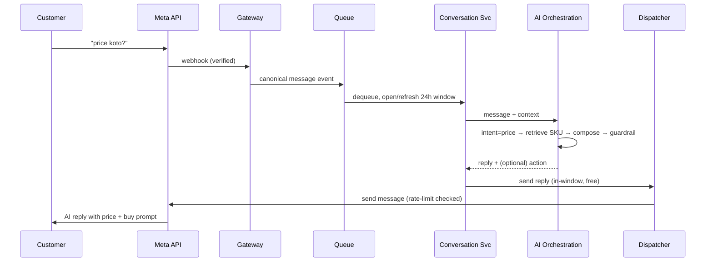
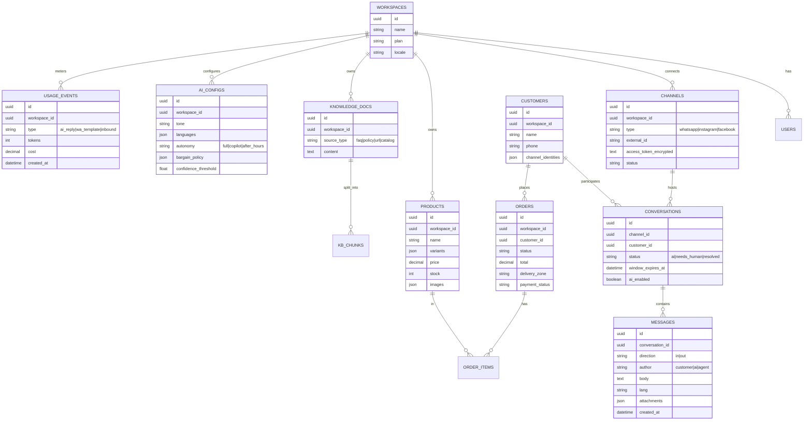

# OmniReply — Product & Technical Specification

**Working title:** OmniReply (placeholder — rename freely)
**One-line:** An omnichannel, AI-powered auto-reply platform that answers f-commerce customers on WhatsApp, Instagram, and Facebook instantly — grounded in the seller's own catalog and policies, in the customer's own language — and hands off to a human when it matters.
**Status:** Draft v1 (specification for an MVP and phased build)
**Primary market assumption:** Bangladesh first, then South Asia / MENA / SEA (markets where Facebook-commerce on social DMs is the dominant retail channel). State this explicitly because it drives language support, payment rails, and pricing.

---

## 1. Problem & Opportunity

F-commerce sellers run their entire store inside social inboxes. A single seller on a Facebook Page, an Instagram shop, and a WhatsApp number can receive dozens to hundreds of messages and comments a day, and the overwhelming majority are repetitive: *"price koto?"*, *"ki ki ache?"*, *"delivery charge koto?"*, *"inside Dhaka e koto?"*, *"size M ache?"*, *"order ta kothay?"*. These arrive across three different apps, often in Banglish (Roman-script Bangla), at all hours.

The pain is concrete:

- **Lost sales from slow replies.** On social DMs, a buyer who doesn't get an answer in minutes buys from the next seller. Response speed is conversion.
- **No 24/7 coverage.** A micro-seller cannot staff an inbox overnight, but buyers message overnight.
- **Channel-switching tax.** Replying means juggling the FB Page inbox, the IG app, and WhatsApp separately, with no shared customer history.
- **Repetition.** 80%+ of messages are the same handful of questions that a machine could answer if it knew the catalog and policies.

The opportunity: collapse all three channels into one inbox, let an AI that *actually knows the seller's products and rules* answer the repetitive 80% instantly and in the buyer's language, capture orders, and escalate the 20% that needs a human. The economic unlock (Section 4) is that replying to an inbound customer message within Meta's 24-hour window is **free** on all three channels — so the marginal cost of an AI reply is essentially just the model inference, not messaging fees.

**Competitive landscape:** ManyChat, Spur, BotSpace, WATI, SleekFlow, Interakt, and similar tools already exist. The wedge here is a *vertical* product for social-commerce micro-sellers in price-sensitive markets: native Bangla/Banglish, local payment rails (bKash/Nagad/SSLCommerz), order-capture-first (not just support), sub-10-minute setup, and local pricing/billing. Differentiation is depth in one niche, not breadth.

---

## 2. Target Users & Personas

**Primary — the micro / small f-commerce seller (solo to ~5 people).** Sells apparel, beauty, gadgets, home, food, etc. Tech-comfortable on phone, not on dashboards. Wants it to "just work" and to stop losing late-night orders. Price-sensitive.

**Secondary — the scaling D2C brand (5–30 people).** Has a small support team, multiple SKUs, real volume. Needs team seats, roles, analytics, and reliable handoff.

**Tertiary — the social-commerce agency / reseller.** Manages many client Pages/numbers. Needs a multi-workspace ("agency") view and white-label options. (This persona also maps to a self-hosted/licensed go-to-market — see Section 8.)

| Persona | Channels | Volume | Cares most about |
|---|---|---|---|
| Solo Seller ("Sadia") | 1 FB Page + WhatsApp | 30–150 msgs/day | Speed, never missing an order, dead-simple setup, low price |
| Scaling Brand ("Rafi") | FB + IG + WhatsApp | 300–2,000 msgs/day | Team handoff, accuracy, analytics, conversion |
| Agency ("Operator") | Many client accounts | Aggregate high | Multi-workspace, white-label, per-client billing |

---

## 3. Value Proposition & Differentiators

1. **Instant, 24/7 replies** in Bangla, Banglish, and English (auto-detected per message).
2. **One inbox for all three channels** — WhatsApp + Instagram DMs + Facebook Messenger + Page/post comments — with a unified customer profile and history.
3. **Grounded AI, not a chatbot that hallucinates.** Answers come from the seller's catalog, FAQ, and policies via retrieval. If the answer isn't known, the AI says it will check and hands off — it never invents a price or stock status.
4. **Order-capture-first.** The AI doesn't just answer; it collects name/address/phone/product/qty, creates an order, and can send a payment link.
5. **Sub-10-minute setup.** One-click channel connect (Meta embedded signup / Facebook Login for Business), catalog import, paste-or-crawl FAQ, pick a tone, test, go live.
6. **Affordable by design.** Because inbound replies within the 24h window are free on Meta's side, the only real cost is model inference — enabling low local pricing and healthy margins.
7. **Trust controls for nervous sellers.** A "suggest-then-send" copilot mode lets the seller approve AI drafts before they go out, until they trust full-auto.

---

## 4. Channels & Platform Integration (end-to-end)

This is the part that makes or breaks the product, and where most of the engineering and compliance risk lives. All three channels run on Meta's Graph API family. The single most important rule across all of them: **a 24-hour "customer service window" opens when a customer messages you, and replying inside that window is free and unrestricted. Re-initiating contact after it closes is restricted and/or paid.** The whole product is designed to live inside that free window.

### 4.1 WhatsApp — WhatsApp Business Platform (Cloud API)

- **What you connect:** A WhatsApp Business Account (WABA) with a verified business and a registered phone number, onboarded via Meta's Embedded Signup so the seller does it in a few clicks.
- **Pricing model (current):** As of **July 1, 2025**, WhatsApp moved from conversation-based pricing to **per-message pricing** for template messages, in four categories: **Marketing, Utility, Authentication, Service**.
  - **Replies to a customer inside the 24-hour service window are free** (free-form/session messages, and utility templates inside the window are also free).
  - **Marketing templates are always charged**, and rates vary by country (e.g., India's marketing rate rose Jan 1, 2026; some markets lowered utility/auth rates).
  - **Click-to-WhatsApp ads** open a **72-hour free-entry window** of unlimited free messaging — relevant if the seller runs FB/IG ads that funnel to WhatsApp.
  - **U.S. (+1) marketing templates are currently blocked** (temporary). Not relevant for the primary market but note it for global expansion.
- **Implication for us:** Auto-replying to inbound buyer messages costs **nothing** on Meta's side. We only incur WhatsApp fees if the seller chooses to *proactively re-engage* outside the window (e.g., a marketing broadcast or an order-update template after 24h). We surface those costs transparently.
- **Setup requirements:** Meta Developer App, WABA, business verification, phone number, message templates pre-approved by Meta for any out-of-window sending.

### 4.2 Instagram — Instagram Messaging via the Messenger Platform (Graph API)

- **What you connect:** An Instagram Professional/Business account, linked to a Facebook Page, authorized through Facebook Login for Business with Advanced Access.
- **Messaging window:** Once a user DMs you, you have a **24-hour window** to send unlimited replies, including promotional ones. **Every new user message resets the window.**
- **After 24 hours:** Only specific, strictly non-promotional **message tags** are allowed. The **Human Agent tag extends the window to 7 days — but it is for real human agents only; Meta explicitly prohibits applying it to automated/bot messages**, and misuse can cost API access. This is a hard compliance constraint: our AI cannot ride the Human Agent tag. Out-of-window re-engagement must be a human action or a compliant one-time notification.
- **One-Time Notifications:** A buyer can opt in to a single follow-up after the window (e.g., "notify me when back in stock").
- **Rate limit:** Practically **~200 messages/hour per IG account** (behavioral throttling). A viral post with 400 comment-triggered DMs in an hour means ~200 go out immediately and the rest queue — our dispatcher must handle this.
- **Comment automation:** Auto-reply to comments on posts/reels and trigger a DM (comment-to-DM) is a core social-commerce pattern and a primary acquisition surface.

### 4.3 Facebook — Messenger + Page/Post Comments (Messenger Platform, Graph API)

- **What you connect:** A Facebook Page via Facebook Login for Business; the same Meta app and webhook infrastructure as Instagram.
- **Messaging window:** Standard **24-hour** messaging window, same shape as Instagram, with message tags and the **7-day Human Agent tag (humans only)** for support.
- **Comments:** Auto-reply to comments on Page posts and "private reply" to a commenter via Messenger (e.g., someone comments "price?" on a post → public acknowledgement + private DM with the answer).

### 4.4 Cross-channel summary

| Constraint | WhatsApp | Instagram | Facebook Messenger |
|---|---|---|---|
| API | WhatsApp Business Platform (Cloud API) | Messenger Platform / Graph API | Messenger Platform / Graph API |
| Inbound reply window | 24h service window | 24h | 24h |
| Reply inside window | **Free**, unrestricted | Free, unrestricted (incl. promo) | Free, unrestricted |
| After window | Templates (marketing paid; utility free in-window) | Non-promo message tags only | Non-promo message tags only |
| Human Agent / extended window | Service window concept | 7 days, **humans only** | 7 days, **humans only** |
| Ad-click bonus window | 72h free (Click-to-WhatsApp) | n/a (engagement-based) | n/a |
| Rate limit to design for | Per-number throughput tiers | ~200 DMs/hour/account | Per-Page throughput |
| Comment-to-DM | n/a | Yes (key surface) | Yes |

### 4.5 Shared Meta integration plumbing (all channels)

- A single **Meta Developer App** with messaging products enabled.
- **Webhooks** for inbound messages, message status, comments, and opt-out events — with **signature verification** on every payload.
- **App Review** to obtain **Advanced Access** for messaging permissions, plus **Business Verification**. *This is a schedule risk: verification + review can take days to weeks and must start at the very beginning of the build, not before launch.*
- **Encrypted storage** of long-lived Page/IG/WABA access tokens per tenant, with refresh handling.

---

## 5. Feature Specification

### 5.1 Onboarding & Setup (the "easy to set up" mandate)

Target **time-to-value under 10 minutes**, mobile-friendly, with sane defaults so a non-technical seller never faces a blank configuration screen.

Guided wizard:

1. **Connect a channel** — one-click via Meta Embedded Signup / Facebook Login for Business. Start with one channel (WhatsApp or FB) to go live fast; add others later.
2. **Bring your catalog** — import via CSV, manual entry, sync from an existing store (WooCommerce/Shopify) or Meta Catalog. Each product: name, variants, price, stock, images, description.
3. **Teach it your FAQ & policies** — paste text, upload a doc, crawl a URL, or auto-generate suggested FAQ from past conversations. Capture business hours, delivery zones and charges, payment methods, and return/exchange policy as structured fields.
4. **Pick a voice & languages** — tone preset (friendly / formal / playful), language set (Bangla, Banglish, English) with auto-detect on by default.
5. **Choose an autonomy level** — full-auto, suggest-then-send (copilot), or auto-only-outside-business-hours.
6. **Test in a sandbox** — chat with the AI as a fake customer and see exactly what it will say before anything goes live.
7. **Go live.**

### 5.2 AI Auto-Reply Engine

- **Intent detection** for the f-commerce question taxonomy: greeting, price, availability/stock, product details, size/variant, delivery charge & time, order placement, order status, payment, location/COD, complaint/return, **bargaining/negotiation**, and out-of-scope.
- **Retrieval-grounded answers (RAG):** every factual answer is composed from retrieved catalog + FAQ + policy data for that tenant. The model is instructed to answer only from retrieved context and to escalate otherwise.
- **Multilingual, including Banglish:** detect and respond in the buyer's language/script; Roman-script Bangla is first-class, not an afterthought.
- **Order capture:** the AI walks the buyer through a structured slot-fill (product → variant → qty → name → phone → address → delivery zone) and creates an order/lead.
- **Bargaining policy (configurable):** hold price / offer up to a max discount / route to human. (Negotiation is a real, expected behavior in this market.)
- **Confidence threshold & handoff:** below a threshold, or on detected anger / refund / legal / payment-dispute intents, hand off to a human and notify the seller.
- **Hard guardrails:** never invent prices, stock, or policies; never make promises outside configured policy; never use the Human Agent tag for AI messages.
- **Hybrid responses:** deterministic canned answers for exact-match FAQs, AI generation for everything else.

### 5.3 Omnichannel Unified Inbox

- One inbox across all channels; a **unified customer profile** that merges identities across channels where possible (e.g., same phone on WhatsApp and at checkout).
- Live conversation view with per-conversation **AI ⇄ Human toggle** and one-tap **takeover**.
- Internal notes, tags, assignment to agents, conversation status (AI-handled / needs-human / resolved).
- Customer timeline: past messages, orders, and order status in one pane.
- Saved replies / quick replies.
- **Mobile app (Flutter)** as a first-class surface — sellers live on their phones; realtime via websockets/push.

### 5.4 Automation & Flows

- **Comment-to-DM** on FB and IG (public reply + private DM).
- **Keyword triggers** and **story-reply triggers** (IG).
- **Welcome / away / business-hours** auto messages.
- **Re-engagement** within the window; compliant **template broadcasts** to opted-in users for out-of-window outreach (WhatsApp), with cost shown.
- **Follow-ups** (e.g., abandoned order nudge) within the window or via one-time notification / template.

### 5.5 Catalog & Lightweight Commerce

- Product catalog with variants, price, stock, images.
- Order/lead management (lightweight CRM): status pipeline (new → confirmed → shipped → delivered → cancelled/returned).
- **Payment links:** bKash, Nagad, SSLCommerz for Bangladesh; Stripe/PayPal for global. (Generation + status callback.)
- Delivery-charge rules by zone (e.g., inside Dhaka / outside Dhaka).
- Optional stock decrement on confirmed order.

### 5.6 Analytics & Insights

- Volume, median response time, **AI resolution rate**, handoff rate — per channel.
- **Conversion:** inquiry → order, and revenue attributed to AI-handled conversations.
- Top questions, most-asked products, and a **list of questions the AI couldn't answer** (feeds back into the knowledge base — a virtuous loop).
- Agent performance; usage/cost (AI tokens, any WhatsApp template fees).

### 5.7 Team, Roles & Multi-Tenancy

- Roles: **owner / admin / agent**.
- Multiple Pages/numbers per workspace.
- **Agency mode:** parent account managing multiple client **workspaces** (sub-accounts) with per-workspace billing and white-label branding.

### 5.8 Settings & Compliance

- Business hours / AI-active hours.
- **Window tracking** per conversation per channel; outbound dispatcher refuses to send anything not allowed by the current window/tag rules.
- Opt-out handling (honor WhatsApp marketing opt-out webhooks; suppress contact).
- Data privacy & retention controls.

---

## 6. UX Principles & Key Flows

**Design principles**

- **Minutes, not hours, to value** — defaults everywhere; never block on a setting.
- **Mobile-first** — the seller's primary device is a phone.
- **Transparency before trust** — show the AI's drafts and let sellers preview/approve until they opt into full-auto.
- **Local-first** — Bangla UI option, local currency, local payment and delivery concepts baked in.
- **Calm, not noisy** — escalations and orders surface clearly; routine AI handling stays quiet.

**Autonomy modes**

1. **Full-auto:** AI replies directly. Best once trust is established and the catalog/FAQ are solid.
2. **Suggest-then-send (copilot):** AI drafts; seller taps to send or edits. Best for onboarding and high-stakes conversations.
3. **Business-hours auto:** human during the day, AI overnight.

**Day-in-the-life flows**

- *Price question:* Buyer DMs "এই জ্যাকেটের দাম কত?" → AI detects product + price intent → retrieves the SKU → replies with price, available sizes, and delivery charge → offers to take the order.
- *Order:* Buyer says "নিব" → AI slot-fills variant/qty/name/phone/address → creates order → sends bKash payment link → notifies seller → marks conversation AI-handled.
- *Escalation:* Buyer is angry about a late delivery → AI detects complaint intent → posts an empathetic holding reply → flags **needs-human** and pushes a notification to the seller with full context.
- *Comment-to-DM:* Someone comments "price?" on a reel → AI public-replies "DM করেছি ✅" and privately sends the price + buy link within the window.

---

## 7. Technical Architecture

Multi-tenant SaaS. The architecture is organized around one idea: **ingest events from Meta, normalize them, decide a response with grounded AI, and dispatch within platform rules** — all asynchronously, idempotently, and per-tenant.

### 7.1 Components

- **Channel Gateway (webhook ingestion):** Receives Meta webhooks for WhatsApp / Instagram / Messenger (messages, statuses, comments, opt-outs). Verifies signatures, dedupes, and emits a **canonical message event** (channel-agnostic shape) onto the queue. Must absorb bursts (viral post → hundreds of comments) and return 200 fast.
- **Message Queue / Event Bus:** (Kafka / RabbitMQ / SQS) for async processing, retries, ordering per conversation, and rate-limit shaping. Essential for the IG ~200/hour cap and WhatsApp throughput tiers.
- **Conversation Service:** Owns conversation state, threading, and **per-channel window/tag tracking** (is this conversation inside its 24h window? which tags are legal right now?).
- **AI Orchestration Service:** The brain. Pipeline per inbound message:
  1. classify intent (small/cheap model or classifier),
  2. retrieve grounding context from the tenant's vector namespace + structured catalog,
  3. compose a reply with an LLM using **function/tool calling** for actions (create order, generate payment link, escalate, schedule follow-up),
  4. run **guardrails** (no invented facts, policy compliance, confidence check),
  5. return the reply + any actions.
  **Provider-agnostic** — pluggable across Claude / GPT-class / others, with a routing layer (cheap model for classification, stronger model for generation) to control cost.
- **Knowledge / RAG Service:** Per-tenant embeddings + vector store with namespace isolation. Ingests catalog, FAQ, policies, and (optionally) past conversations. Re-indexes on catalog changes.
- **Catalog & Order Service:** Products, variants, stock, orders/leads, delivery rules, payment-link integrations and callbacks.
- **Outbound Dispatcher:** The only component allowed to call Meta send APIs. Enforces window/tag legality, per-channel rate limits (token-bucket per account), template selection for out-of-window sends, retries, and idempotency keys.
- **Dashboard Web App** + **Flutter Mobile App** + **Realtime layer** (websockets/push) for the live inbox.
- **Platform services:** Auth, billing & subscription, **usage metering** (messages, tokens, template fees), notifications.

### 7.2 Data stores

- **Relational DB** (PostgreSQL recommended; MySQL acceptable to match an existing Laravel/MySQL stack) — primary store, multi-tenant via `tenant_id` + row-level security / strict scoping.
- **Redis** — caching, conversation **window state**, and rate-limit counters.
- **Vector store** — pgvector (keeps it in Postgres), or Qdrant/Pinecone/Weaviate if scaling separately. (Note: if standardizing on MySQL, run embeddings/vectors in a dedicated vector service or use MySQL's newer vector support rather than bolting it on.)
- **Object storage** (S3-compatible) — product images, media, message attachments.

### 7.3 Suggested stack (pragmatic, CodeCanyon/self-host-friendly)

Given a Flutter + PHP/MySQL ecosystem and the option to also sell a self-hosted license: **Laravel (PHP) backend**, **MySQL or PostgreSQL**, **Redis + queue (Horizon/Redis or RabbitMQ)**, **Flutter mobile app**, and a **Vue/React or Livewire dashboard**. The AI orchestration and RAG can be a small companion service (Python or Node) called over an internal API, keeping the model layer swappable without coupling it to the core CRUD app. Nothing here is load-bearing — the architecture is language-agnostic; choose what the team ships fastest.

### 7.4 System diagram

```mermaid
flowchart LR
  subgraph Meta
    WA[WhatsApp Cloud API]
    IG[Instagram Graph API]
    FB[Messenger Graph API]
  end

  WA -- webhook --> GW[Channel Gateway\n(verify + normalize)]
  IG -- webhook --> GW
  FB -- webhook --> GW

  GW --> Q[(Event Bus / Queue)]
  Q --> CONV[Conversation Service\n(state + 24h window)]
  CONV --> AI[AI Orchestration\nintent → RAG → compose → guardrails]
  AI --> KB[(Vector Store / RAG)]
  AI --> CAT[Catalog & Order Service]
  AI --> DISP[Outbound Dispatcher\n(window + rate-limit enforced)]
  DISP --> WA
  DISP --> IG
  DISP --> FB

  CONV --> RT[Realtime Inbox]
  RT --> WEB[Dashboard]
  RT --> APP[Flutter Mobile App]

  CAT --- DB[(PostgreSQL/MySQL)]
  CONV --- DB
  CONV --- REDIS[(Redis: window + rate state)]
  AI --- LLM[LLM Provider\n(pluggable)]
```

### 7.5 Inbound message sequence



### 7.6 Cross-cutting concerns

- **Idempotency:** every webhook and every send keyed to avoid duplicate replies on retries.
- **Burst handling:** queue + per-account token buckets so a viral comment storm degrades gracefully (queue overflow, not API bans).
- **Security:** encrypted token vault for Meta tokens; webhook signature verification; tenant isolation (RLS/scoping); PII minimization and retention policy; audit log of AI actions (orders created, escalations, sends).
- **Observability:** webhook health, window-expiry errors, rate-limit hits, model latency/cost per tenant.

### 7.7 Core data model (sketch)



---

## 8. Business Model & Pricing

### 8.1 How the money works

- **COGS per AI reply ≈ model inference only.** Inbound replies inside the 24h window are free on all three Meta channels, so we are not paying messaging fees for the core auto-reply loop. This is the structural margin advantage.
- **Variable costs that do exist:** WhatsApp **marketing templates** (proactive re-engagement, country-priced), LLM tokens, and infra. We pass WhatsApp template fees through transparently or bundle a small allowance.
- **Pricing must fit a price-sensitive market:** local currency display, **bKash/Nagad billing**, and an annual discount.

### 8.2 SaaS tiers (illustrative — validate before committing numbers)

| Tier | For | Channels | AI replies / mo | Seats | Indicative BDT/mo | Indicative USD/mo |
|---|---|---|---|---|---|---|
| **Free** | Trial / solo starter | 1 | ~200 | 1 | ৳0 | $0 |
| **Starter** | Solo seller | 1–2 | ~2,000 | 1 | ৳800–1,200 | $8–12 |
| **Growth** | Busy seller | 3 | ~10,000 | 3 | ৳2,500–3,500 | $25–35 |
| **Business** | Small brand | 3 | ~40,000 | 8 | ৳7,000–10,000 | $70–100 |
| **Agency** | Resellers | Many workspaces | Pooled / custom | Many | Custom | Custom |

- **AI overage:** pay-as-you-go beyond the monthly allowance, metered by replies or tokens.
- **WhatsApp marketing template fees:** billed through at cost (shown clearly before sending).

### 8.3 Two go-to-market options

1. **Hosted SaaS** (recommended core) — monthly/annual subscription, you operate the infrastructure and Meta apps.
2. **Self-hosted / licensed** — a white-label, self-hostable build sold as a one-time-license product (e.g., on a marketplace like CodeCanyon). This suits the agency persona and buyers who want to run their own instance and resell. It also widens distribution. Trade-off: self-hosted buyers manage their own Meta app review, tokens, and LLM keys, so the onboarding and docs for that edition must be excellent. Many teams run **both** — hosted for end-sellers, licensed for agencies/resellers.

---

## 9. MVP Scope & Roadmap

**Start Meta Business Verification and App Review on day one** — it gates launch and can take weeks.

**Phase 0 — MVP (validate the core loop):**
- Channels: **WhatsApp + Facebook Messenger** (fastest path; add IG next).
- Grounded AI auto-reply over FAQ + manually/CSV-imported catalog.
- Unified inbox (web), AI↔human toggle, basic handoff.
- Bangla / Banglish / English with auto-detect.
- Suggest-then-send + full-auto modes.
- Basic analytics (volume, response time, resolution rate).

**Phase 1 — Complete the channel + commerce story:**
- Instagram DMs + comment-to-DM (FB & IG).
- **Flutter mobile app.**
- Order capture + bKash/Nagad/SSLCommerz payment links.
- Compliant template broadcasts (opt-in) and follow-ups.
- Unanswered-question loop into the knowledge base.

**Phase 2 — Scale & monetize the segments:**
- Agency multi-workspace + white-label.
- Deeper commerce (store sync: WooCommerce/Shopify, inventory).
- Advanced flows/automations, A/B replies, richer analytics.
- Self-hosted/licensed edition.

**Phase 3 — Expand:**
- Voice-note understanding (buyers send voice messages), web-chat widget, additional channels (Telegram/Viber), more markets/languages, marketplace integrations.

---

## 10. Risks & Mitigations

| Risk | Impact | Mitigation |
|---|---|---|
| Meta policy / API changes or **App Review rejection** | Launch blocked, features pulled | Compliance-first design; start verification early; support multiple channels so one rejection isn't fatal |
| **AI hallucination** (wrong price/stock) | Lost trust, bad orders | Strict RAG grounding, confidence-based handoff, preview/copilot mode, never invent facts |
| **WhatsApp/IG spam violations** | Account/API bans | Opt-in enforcement, window/tag tracking, **never use Human Agent tag for AI**, rate-limit shaping |
| **LLM cost overruns** | Margin erosion | Cheap model for routing, caching, quotas, usage metering, allowance + overage pricing |
| **Banglish quality** | Poor UX in core market | Few-shot/fine-tuned prompts, human-in-loop learning, graceful fallback |
| Established competitors | Hard to stand out | Win the f-commerce niche: Bangla/Banglish, local payments, order-first, price, sub-10-min setup |
| Burst load (viral posts) | Missed replies / bans | Queue + per-account token buckets; degrade gracefully |

---

## 11. Success Metrics

- **Activation:** % of signups that connect ≥1 channel and go live within 24h.
- **Time-to-value:** median setup time **< 10 minutes**.
- **AI resolution rate:** target **70%+** of conversations handled without human.
- **Response time:** median first AI reply **< 5 seconds**.
- **Conversion lift:** inquiry → order rate vs. pre-OmniReply baseline.
- **Retention / NRR:** monthly logo churn and net revenue retention; allowance utilization as an expansion signal.

---

## 12. Open Questions & Assumptions

- **Primary market** assumed Bangladesh + South Asia/MENA/SEA. Confirm, because it drives language, payments, and pricing.
- **LLM strategy:** hosted API (fastest) vs. self-hosted open model (cost/control at scale). Recommend hosted API for MVP.
- **Go-to-market:** hosted-only at first, or ship the self-hosted/licensed edition early to capture agencies/resellers?
- **Payment providers** priority order (bKash vs. Nagad vs. SSLCommerz vs. global).
- **Voice notes** — common in this market; how early to support speech-to-text?

---

*This spec is a starting point. The two decisions that most shape everything downstream are (1) which single channel to launch first to clear Meta review fastest, and (2) hosted-only vs. hosted + licensed. Lock those, and the Phase-0 build is well-defined.*