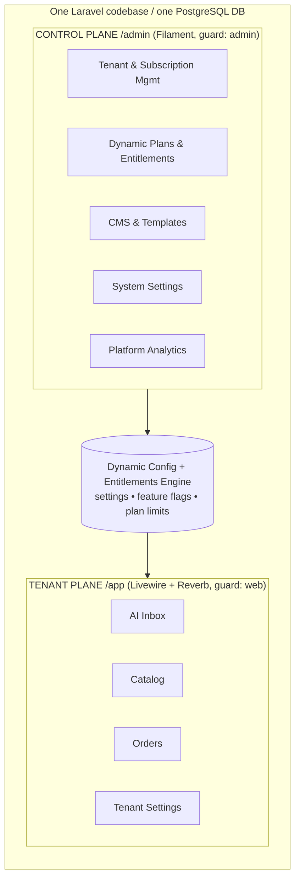
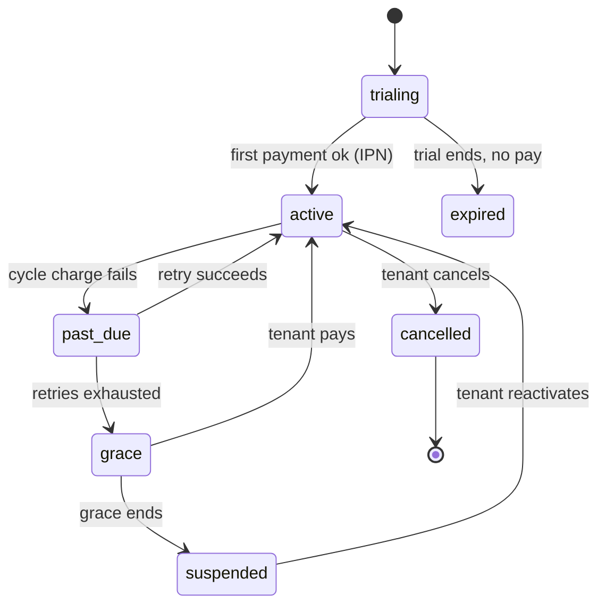
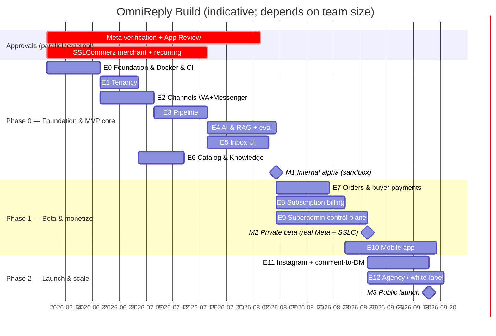

# OmniReply — Software Development Plan

**Companion to:** Product Spec + Laravel Architecture docs. This document is the **execution plan**: how to build it, in what order, with what process, environments, and tooling.

**Confirmed stack additions in this round**
- **AI:** OpenRouter (accessed via Prism) — one endpoint to hundreds of models with automatic fallbacks; covers generation *and* embeddings, so the whole pgvector pipeline runs through it.
- **Tenant subscription billing:** SSLCommerz — payment execution + tokenization + IPN only; **no native subscription engine, so we build the billing engine in-app.**
- **Containers:** Docker for both local development and production (dev/prod parity).
- **Operator control:** a **superadmin control plane** built on **Filament** (multi-panel), with a **dynamic configuration + entitlements engine** so the operator manages subscriptions, plans, CMS, and system settings without code changes.

---

## 1. The Two-Plane Model (the organizing idea)

The system is split into two planes that share one codebase and one database:

| Plane | Who uses it | What it does | Built with |
|---|---|---|---|
| **Control plane** (`/admin`) | OmniReply operator team (you) | Manage all tenants & subscriptions, define plans & entitlements, edit CMS/content, configure the whole platform, view platform analytics | **Filament** panel + dynamic config engine |
| **Tenant plane** (`/app`) | F-commerce sellers (tenants) | The product: omnichannel AI inbox, catalog, orders, their own settings | **Custom Livewire + Reverb** (inbox) + some Filament-driven CRUD |

**"Total dynamic control"** means the control plane is **settings-driven, feature-flagged, and content-managed**: plans/limits/features, pricing, CMS pages, email/notification templates, branding, and most system configuration live in the database and are editable from the panel — the tenant plane reads its behavior from those records at runtime. The one deliberate exception is the most sensitive master secrets (see §8.4).

Filament's multi-panel system is what makes this clean: two panels, two auth guards (`admin` and `web`/tenant), separate navigation and resources, shared Eloquent models. Use **Filament v4 (Livewire 3)** for a battle-tested base, or **Filament v5 (Livewire 4)** if you want the newest; both are actively maintained and the choice doesn't change this plan.



---

## 2. Development Approach & Cadence

- **Methodology:** lightweight Agile, **2-week sprints** with milestone gates (M0–M4 in §12). Ceremonies kept minimal: sprint planning, mid-sprint check, demo + retro.
- **Tracking:** GitHub Issues + Projects. Hierarchy: **Epic → Story → Task**, labeled by module. Each epic in §11 becomes a GitHub milestone or project column.
- **Branching:** trunk-based with short-lived feature branches → PR → `main` (protected, requires green CI + 1 review). Release tags (`v0.x`) cut from `main`. (Mirrors your multi-branch GitHub Actions experience.)
- **Definition of Ready (DoR):** story has acceptance criteria, touched modules identified, test approach noted.
- **Definition of Done (DoD), global:** code + tests written and green, **Pint** formatted, **Larastan** clean, PR reviewed, migrations included, docs/changelog updated, deployed to staging.

---

## 3. Team & Roles

| Role | Responsibility | Lean reality (small team) |
|---|---|---|
| Backend (Laravel) | Pipeline, drivers, AI, billing, control plane | Core — you / lead |
| Frontend (Livewire) | Tenant inbox UX, Filament panels | Shared with backend |
| Mobile (Flutter) | App (Sanctum API + Reverb + FCM) | **Defer to Phase 1** |
| AI/Prompt | Prompts, eval harness, guardrails | Shared with backend |
| DevOps | Docker, CI/CD, infra, observability | Shared; you own it |
| QA | Test strategy, UAT, beta feedback | Shared early; dedicate later |
| Product/PM | Backlog, priorities, beta sellers | You |

A solo or 2–3 person team can ship Phase 0 by sequencing epics (§11) and deferring mobile + agency. Outsource only well-bounded pieces (e.g., Flutter app) once the API is stable.

---

## 4. Environments & Configuration

| Env | Purpose | How | Deploy trigger |
|---|---|---|---|
| **Local** | Daily dev | Docker Compose (§7) | — |
| **Staging** | Integration, UAT, demos | Same image, staging compose/host | auto on merge to `main` |
| **Production** | Live | Same image, prod host | manual on release tag |

- **Config & secrets:** `.env` per environment, never committed; inject prod secrets via GitHub Actions secrets / host env / a secrets manager. App-level operational config lives in the DB settings engine (§8.4), not `.env`.
- **Sandbox accounts to provision day one:** Meta **test app**, SSLCommerz **sandbox** (`sandbox.sslcommerz.com`), OpenRouter **API key + prepaid test credits**, FCM project (for Phase 1).

---

## 5. Dockerized Setup — Local + Production

**Strategy:** one **multi-stage image** based on **FrankenPHP** (runs PHP + web server in one process, ideal for Octane and webhook throughput). The *same image* runs every role — web, queue workers, websockets, scheduler — by changing the start command. This guarantees dev/prod parity.

### 5.1 Local (`docker-compose.yml`)

```yaml
services:
  app:            # FrankenPHP/Octane (web) — watch mode for hot reload in dev
    build: { context: ., target: dev }
    ports: ["8000:8000"]
    depends_on: [postgres, redis]
    volumes: [".:/app"]
  horizon:        # queue workers (same image)
    build: { context: ., target: dev }
    command: php artisan horizon
    depends_on: [redis, postgres]
    volumes: [".:/app"]
  reverb:         # websocket server
    build: { context: ., target: dev }
    command: php artisan reverb:start --host=0.0.0.0
    ports: ["8080:8080"]
    depends_on: [redis]
    volumes: [".:/app"]
  scheduler:      # cron loop
    build: { context: ., target: dev }
    command: php artisan schedule:work
    depends_on: [redis, postgres]
    volumes: [".:/app"]
  postgres:
    image: pgvector/pgvector:pg17      # Postgres WITH pgvector preinstalled
    environment: { POSTGRES_DB: omnireply, POSTGRES_PASSWORD: secret }
    ports: ["5432:5432"]
    volumes: ["pgdata:/var/lib/postgresql/data"]
  redis:
    image: redis:7-alpine
  mailpit:        # catches outbound mail locally
    image: axllent/mailpit
    ports: ["8025:8025"]
  minio:          # local S3 for media (optional)
    image: minio/minio
    command: server /data --console-address ":9001"
    ports: ["9000:9000","9001:9001"]
  node:           # Vite dev server / asset build (or run on host)
    image: node:22-alpine
    command: sh -c "npm install && npm run dev"
    volumes: [".:/app"]
volumes: { pgdata: {} }
```

Wrap common tasks in a `Makefile` (`make up`, `make migrate`, `make test`, `make fresh`). Hot reload: Octane `--watch` for PHP + Vite HMR for assets.

### 5.2 Production (multi-stage `Dockerfile`)

```dockerfile
# 1) composer deps
FROM composer:2 AS vendor
WORKDIR /app
COPY composer.* ./
RUN composer install --no-dev --prefer-dist --no-scripts --no-autoloader

# 2) frontend build
FROM node:22-alpine AS assets
WORKDIR /app
COPY package*.json vite.config.* ./
RUN npm ci
COPY resources resources
RUN npm run build

# 3) runtime (same base used for dev target too)
FROM dunglas/frankenphp:latest AS prod
WORKDIR /app
RUN install-php-extensions pdo_pgsql redis intl opcache pcntl
COPY . .
COPY --from=vendor /app/vendor ./vendor
COPY --from=assets /app/public/build ./public/build
RUN composer dump-autoload --optimize && php artisan optimize
CMD ["php", "artisan", "octane:frankenphp", "--host=0.0.0.0", "--port=8000"]
```

- **Roles in prod** = same image, different `command`: `octane:frankenphp` (web), `horizon`, `reverb:start`, `schedule:work`. Orchestrate with a production compose file, Docker Swarm, or Kubernetes — start with compose-on-VPS (or Laravel Forge / Laravel Cloud for managed Reverb) and grow into orchestration only if needed.
- **Edge:** Caddy/Traefik for TLS + WebSocket upgrade routing to the Reverb service.
- **Data:** managed or containerized Postgres (pgvector) + Redis with persistent volumes and automated backups; S3-compatible object storage.
- **Registry:** build in CI, push to **GHCR**, pull on deploy.
- **Zero-downtime deploy:** `php artisan migrate --force` → `php artisan octane:reload` → `php artisan horizon:terminate` (graceful worker restart on new code).
- **Octane caution:** reset workspace/tenant context per request and per job; never hold tenant state in singletons.

---

## 6. AI Integration Plan (OpenRouter via Prism)

- **Setup:** OpenRouter account + key + prepaid credits; configure Prism's OpenRouter provider. Provider/model choices live in config and the settings engine (so the operator can swap models without a deploy).
- **Model routing strategy:**
  - *Intent classification* → a cheap/fast model.
  - *Reply composition* → a stronger model.
  - *Embeddings* → an OpenRouter embedding model; **lock the vector dimension** (e.g., 1536) to the `kb_chunks.embedding` column. Changing the embedding model later requires re-embedding the whole corpus — treat dimension as a one-way door.
- **Resilience:** enable OpenRouter fallbacks (`allow_fallbacks`) plus Prism-level provider fallback. Handle `429` (rate limit) and `529` (provider overloaded) with exponential backoff; handle **`402` (insufficient credits)** as a first-class operational alert — low balance must page ops, because it halts all AI. Add per-tenant token budget caps.
- **Prompt management:** versioned prompt templates (repo + editable defaults in settings), per-tenant tone/language injected at runtime, `Prism::structured()` schemas for order-capture slot-filling.
- **Guardrails (build as discrete tasks):** confidence scoring + threshold handoff; allow-listed tools (`create_order`, `generate_payment_link`, `escalate_to_human`, `schedule_followup`); **catalog facts (price/stock) read relationally, never vectorized** (anti-hallucination); anger/refund/legal detection → human; dispatcher hard-blocks the Human Agent tag for AI sends.
- **AI eval harness (own workstream):** a fixture set of real Bangla/Banglish/English f-commerce questions with expected behaviors. Unit tests use Prism's fake; a scheduled eval scores accuracy, hallucination rate, and handoff correctness against the fixtures. **Full-auto mode is gated on passing the AI quality bar** (§13/§18).
- **Cost controls:** per-workspace token metering, response caching for identical FAQ hits, intent short-circuit to canned answers.

---

## 7. Subscription Billing Plan (SSLCommerz, in-app engine)

SSLCommerz gives you hosted/easyCheckout (V4), tokenization, and **IPN** server callbacks — but no subscription manager. So you build the billing engine; SSLCommerz is the payment executor. (Laravel Cashier won't help — it's Stripe/Paddle.)

**Charging models (support both):**
1. **Tokenized auto-rebill (primary):** first payment via hosted checkout captures a card **token (stored at SSLCommerz; you store only the token reference → minimal PCI scope)**. The scheduler charges the stored token on each cycle via the SSLCommerz API; IPN confirms; failures enter dunning. Requires recurring/tokenization enabled on the merchant account.
2. **Manual renewal (fallback):** for wallets/cards that can't tokenize — scheduler issues a renewal invoice + hosted-checkout link, notifies the tenant before expiry; on IPN success, extend; on lapse, grace → suspend.

**Flow & trust boundary:** plan selection → initiate SSLCommerz session → redirect/popup → success/fail/cancel return URLs are **not trusted alone**; the **IPN (server-to-server) is the source of truth**, validated against SSLCommerz's validation API by `val_id`, idempotent on `tran_id`.

**Subscription lifecycle (state machine):**



- **Dunning & reminders** via email + in-app + WhatsApp before charge and on failure.
- **Plan enforcement** is dynamic (§8.2): channels, AI replies/mo, seats, products checked against the tenant's plan entitlements via `usage_events`; overage handling and mid-cycle upgrade/downgrade.
- **Billing data model:** `plans`, `subscriptions`, `invoices`, `payment_transactions`, `payment_tokens` (token ref only), `usage_counters`.
- **Testing:** SSLCommerz sandbox store creds + test cards + simulated IPN posts.
- **Dependency:** SSLCommerz **merchant onboarding + recurring enablement has lead time and documentation requirements** — apply on day one (parallel track in §12); build against sandbox meanwhile; ship manual-renewal first if recurring approval lags.

> Note: SSLCommerz appears twice in the product — here for **tenant subscription billing** (operator gets paid) and earlier for **buyer order payments** in the f-commerce flow (seller gets paid). Same gateway, two separate integrations/configs.

---

## 8. Superadmin Control Plane & Dynamic Configuration Engine

This is the operator's cockpit — built as a **Filament panel** at `/admin` with its own `admin` guard and RBAC, plus the **dynamic engine** that the tenant plane reads from.

### 8.1 Tenant & Subscription Management
Filament resources to: list/search all workspaces; view a tenant's plan, usage vs. limits, channels, seats, billing history; **manually create/extend/suspend/cancel subscriptions, comp accounts, extend trials, apply credits/refunds, override limits per tenant**; **impersonate ("login as") a tenant** for support (audited); flag/lock abusive tenants.

### 8.2 Dynamic Plans & Entitlements Engine
- **Plans defined in DB**, editable from the panel: name, prices (BDT/USD), billing cycle, trial length, and **entitlements** (channels, AI replies/mo, seats, products, feature toggles). Coupons/promo codes.
- **Entitlements service** the whole app calls — e.g., `Gate::allows('feature:instagram')` / `entitlements()->limit('ai_replies')` — reads the tenant's plan record, **not hardcoded constants**. Implement feature flags with **Laravel Pennant** (per-plan/per-tenant) and quantitative limits via a small entitlements service backed by `usage_counters`.
- Result: launching a new plan or toggling a feature for a tier is a panel action, zero deploy.

### 8.3 CMS & Content Management
Operator-editable content powering the public site and platform comms:
- Marketing pages (hero, features, pricing display, testimonials, FAQ), blog/articles, navigation/footer, legal pages (terms, privacy, refund).
- **Email templates** (transactional + marketing) and **notification templates** — editable, variable-aware.
- **Media library**; **SEO meta**; **multi-language content (Bangla/English)** via translation tables.
Filament resources + a rich editor handle this; consider Filament plugins for user-defined dashboards/fields where deeper dynamism is wanted.

### 8.4 System Settings / Dynamic Config
- A **settings subsystem** (grouped key–value or typed setting classes, e.g., `spatie/laravel-settings`), **cached**, with typed accessors and a Filament settings UI. Covers: branding (name, logo, favicon, colors, contact), currency/locale/timezone defaults, default AI tone/prompt, default quotas, maintenance mode, feature toggles platform-wide.
- **Provider config** (SSLCommerz store id/keys + sandbox toggle, OpenRouter model selection + budgets, SMTP, storage, Meta app id/secret + webhook verify token) editable from the panel **but encrypted at rest**.
- **Security nuance for "total dynamic control":** anything editable in the panel that is a secret is stored with Laravel's `encrypted` cast; the **most sensitive master secrets (APP_KEY, DB creds) stay in `.env`/secrets manager**, never in the DB or the UI. Total dynamic control over *operational* config — not over the keys that protect it.

### 8.5 Admin RBAC & Audit
- Admin team with roles (Super Admin, Support, Billing, Content Editor) via **spatie/laravel-permission**; Filament navigation/resources gated per role.
- **Audit log** of every admin action (subscription changes, impersonation, setting edits, refunds) — non-negotiable for an operator panel.

### 8.6 Platform Analytics
Operator dashboards/widgets: **MRR/ARR, churn, signups, active/trial/suspended tenants, revenue, AI usage & OpenRouter cost across all tenants, message volume, conversion funnels.** Read from rollups (scheduler) to keep dashboards fast.

### 8.7 Support, Announcements & White-Label
- Inbound contact/support messages; **announcements/broadcasts to tenants** (in-app banners + email).
- **White-label/theming settings** (logo, colors, custom domain) — wired so the licensed/agency edition can rebrand from the panel.

---

## 9. Work Breakdown Structure (Epics → representative stories)

| Epic | Scope (sample stories) | Phase |
|---|---|---|
| **E0 — Foundation & DevEx** | Repo, Docker local stack, CI skeleton, base Laravel + Livewire + Filament panels + Postgres/pgvector + Redis + Horizon + Reverb; auth (web + admin guards); Pint/Larastan/Pest | 0 |
| **E1 — Tenancy & Workspaces** | Workspaces, members, roles, `workspace_id` scoping (+ optional RLS), tenant onboarding wizard | 0 |
| **E2 — Channels: WhatsApp + Messenger** | Driver pattern, webhook ingest + HMAC verify, encrypted token vault, send/template | 0 |
| **E3 — Messaging Pipeline** | Canonical message model, 3 jobs (ingest→generate→send), queues, idempotency, 24h window tracking, per-account rate limiting, dispatcher | 0 |
| **E4 — AI & RAG (OpenRouter+Prism)** | Provider config, intent classifier, pgvector KB + indexing job, compose, tools, guardrails, **eval harness** | 0 |
| **E5 — Tenant Inbox (Livewire+Reverb)** | Conversation list/thread/composer, realtime events, AI↔human toggle, handoff, notes/tags/assignment | 0 |
| **E6 — Catalog & Knowledge ingest** | Products/variants/stock, CSV import, FAQ/policy ingest + re-index | 0 |
| **E7 — Orders & Buyer Payments** | Order capture (structured output), order mgmt, SSLCommerz buyer payment links + IPN | 1 |
| **E8 — Subscription Billing** | In-app engine, SSLCommerz tokenized rebill + manual renewal, IPN validation, dunning, lifecycle, limit enforcement | 1 |
| **E9 — Superadmin Control Plane** | Tenant/subscription mgmt, **dynamic plans/entitlements**, CMS, **system settings engine**, admin RBAC + audit, platform analytics, announcements, white-label | 1 |
| **E10 — Mobile App (Flutter)** | Sanctum API, Reverb client, FCM push, inbox + orders | 1–2 |
| **E11 — Instagram + Comment-to-DM** | IG driver, comment triggers, one-time notifications | 2 |
| **E12 — Agency / Multi-workspace** | Parent accounts, sub-account billing, white-label edition | 2 |
| **E13 — Hardening (cross-cutting)** | Security, compliance enforcement, load testing, observability, backups, runbooks | continuous |

---

## 10. Phased Roadmap, Milestones & Timeline

Three tracks run in **parallel** — code, Meta App Review/Business Verification, and SSLCommerz merchant onboarding — because the latter two gate *launch*, not coding, and have external lead times. **Start both approval tracks on day one.**



**Milestones**
- **M0 — Foundation ready:** Docker stack up, CI green, both Filament panels scaffolded, auth working.
- **M1 — Internal alpha:** pipeline + AI + inbox working on WA + Messenger against the Meta **test app** (sandbox).
- **M2 — Private beta:** real Meta approval + SSLCommerz live; billing + onboarding + superadmin operational; a handful of real sellers.
- **M3 — Public launch:** Instagram + comment-to-DM + polished payments + (ideally) mobile app.
- **M4 — Scale:** agency/white-label + deeper analytics.

*Durations are estimates for a small team and compress with more people; the approval bars are the realistic critical path to public launch.*

---

## 11. Testing & QA Strategy

- **Unit (Pest):** services, entitlements, billing math, guardrail logic.
- **Feature/Integration:** HTTP endpoints, queued jobs, DB (Postgres + Redis **service containers** in CI), multi-tenant scoping.
- **Channel contract tests:** `Http::fake()` against recorded Meta payloads; verify window/tag legality and rate-limit behavior.
- **AI tests:** Prism fake for unit-level; the **eval harness** (Bangla/Banglish/English fixtures) scoring accuracy, hallucination rate, and handoff correctness.
- **Billing tests:** SSLCommerz **sandbox** + simulated IPN; lifecycle transitions; dunning; idempotency on `tran_id`.
- **E2E:** critical flows (signup→onboard→connect channel→AI reply→order→subscribe→pay).
- **Load:** webhook-burst simulation (viral post → hundreds of comments) with k6/artillery; confirm queue + token-bucket degradation, not failure.
- **Security:** authz/tenant-isolation tests, dependency scanning (Dependabot), pen-test before public launch.
- **UAT:** staging sign-off each release + a beta-seller feedback loop.
- **Quality gates:** AI quality bar met **before enabling full-auto in prod**; coverage thresholds on pipeline, billing, and drivers.

---

## 12. CI/CD Pipeline (GitHub Actions)

```
push / PR
  → install (composer + npm, cached)
  → lint (Pint)  → static analysis (Larastan)
  → tests (Pest)  [services: postgres+pgvector, redis]
  → build multi-stage Docker image
  → push to GHCR
  → deploy STAGING (auto on merge to main): pull image, migrate --force, octane:reload, horizon:terminate, smoke test
  → [manual approval / environment protection]
  → deploy PRODUCTION (on release tag): same steps + post-deploy smoke + health check
```

Cache composer/npm/Docker layers; store secrets in GitHub Actions secrets with environment protection rules; mirror your existing multi-branch + release-tag workflow.

---

## 13. Observability, Ops & Runbooks

- **Metrics:** **Pulse** in prod (queues, slow queries, Reverb connections, exceptions); **Telescope** in non-prod; structured JSON logs; uptime monitoring.
- **Alerting:** queue backlog, **OpenRouter low credit / `402`**, **SSLCommerz IPN failures**, Reverb connection saturation, failed jobs, Meta token expiry/ban.
- **Backups:** automated Postgres backups + periodic restore drills; object-storage lifecycle.
- **Runbooks:** Meta token expiry/ban recovery; OpenRouter outage/credit exhaustion (degrade gracefully, hold AI, notify); payment IPN failure handling; queue backlog drain; zero-downtime deploy + rollback.

---

## 14. Security & Compliance Workstream (continuous)

- Encrypted token vault; **HMAC webhook verification**; tenant isolation (global scope + optional RLS); admin **audit log**; PII minimization + retention pruning.
- **Meta-policy enforcement in code:** per-send window legality; **AI never uses the Human Agent tag**; opt-out suppression; per-account rate limiting.
- **PCI scope minimized** (card tokens stored at SSLCommerz; you hold references only).
- Secrets discipline (§8.4): operational config dynamic + encrypted; master secrets in env only.
- Dependency scanning; pen-test before public launch.

---

## 15. Risks, Dependencies & Mitigations

| Risk | Impact | Mitigation |
|---|---|---|
| **Meta App Review / verification lead time** | Blocks public launch | Start day one; single-channel first; build on test app meanwhile |
| **SSLCommerz merchant + recurring approval** | Blocks paid subscriptions | Apply day one; sandbox dev; ship manual-renewal before recurring lands |
| **OpenRouter outage / credit exhaustion / rate limits** | AI stops | Fallbacks + backoff; **credit alerting**; per-tenant budgets; provider swap via Prism |
| **AI quality (Banglish, hallucination)** | Bad UX, lost trust | Eval harness + guardrails + copilot mode; full-auto gated on quality bar |
| **"Dynamic control" secret leakage** | Security incident | Encrypt editable secrets; keep master secrets in env only; audit setting edits |
| **Octane tenant-state leakage** | Cross-tenant data exposure | Reset workspace context per request/job; no stateful singletons |
| **pgvector perf / Postgres write hotspot** | Slow at scale | HNSW index, scoped queries; partition `messages`/`usage_events`; ULID PKs |
| **Webhook bursts** | Missed replies / bans | Enqueue-and-200; queues + per-account token buckets |
| **Scope creep** | Slips launch | Phased MVP, strict DoD, defer mobile/agency |
| **Small-team bandwidth** | Slips timeline | Sequence epics; outsource bounded work (Flutter) post-API-stability |

---

## 16. Definition of Done & Release Criteria

- **Task DoD:** §2 global DoD met.
- **Alpha (M1):** core pipeline + AI + inbox demonstrably working on WA + Messenger in sandbox; eval harness running.
- **Beta (M2):** Meta-approved + SSLCommerz live; billing lifecycle + dunning verified; superadmin control plane operational; security review passed; load test passed; AI quality bar met for at least copilot mode.
- **GA (M3):** Instagram + comment-to-DM live; payments hardened; pen-test cleared; runbooks + backups + monitoring in place; full-auto enabled only where AI quality bar is met.

---

*Build order in one line: stand up the Dockerized foundation with both Filament panels → tenancy → WhatsApp/Messenger pipeline → OpenRouter+pgvector AI → Livewire inbox → then billing + the superadmin control plane with its dynamic config/entitlements engine → Instagram, mobile, agency. Kick off Meta App Review and SSLCommerz onboarding on day one — they, not the code, set your date to revenue.*