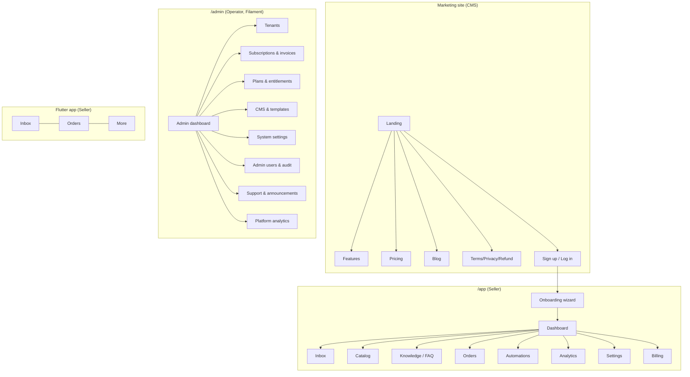
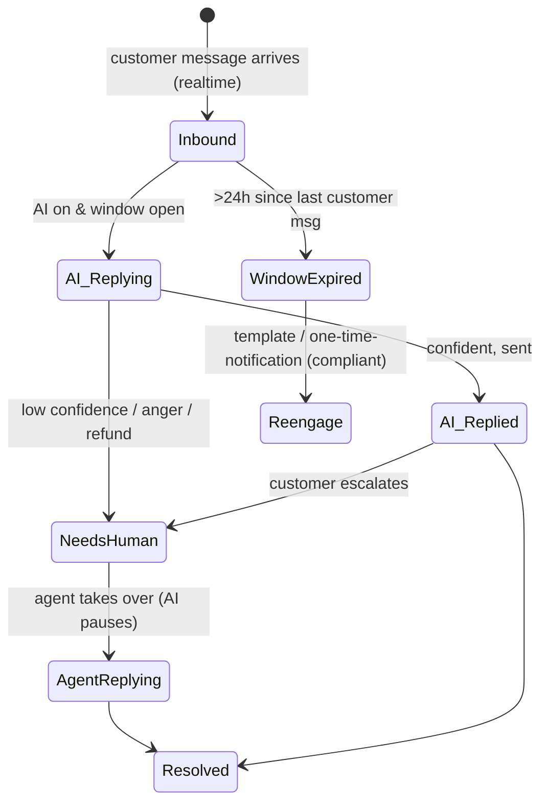
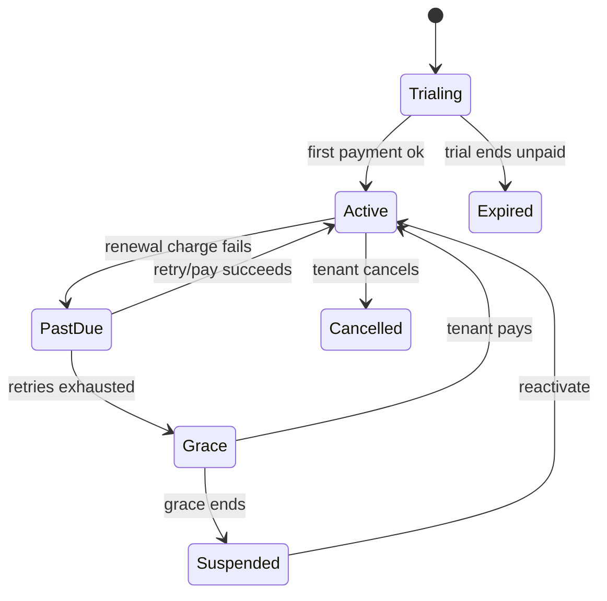

# OmniReply — UI/UX & User Journey Specification

**Companion to:** Product Spec, Architecture, Development Plan, and the Superadmin/Control-Plane design. This document is the **experience layer**: every surface, every journey (micro-step by micro-step), and **every screen state and edge case**.

**Surfaces covered**
1. **Marketing site** (public, CMS-driven) — acquisition.
2. **Tenant plane** (`/app`) — the seller's product (web).
3. **Superadmin control plane** (`/admin`) — the operator (Filament).
4. **Mobile app** (Flutter) — tenant inbox on the phone.

**How to read screen states:** for each screen the relevant states from this set are specified — **Empty · Loading · Populated · Partial/Skeleton · Success · Error · Permission-denied · Edge** (e.g. expired window, rate-limited, payment failed). "Every case" lives mostly in the state tables.

**Assumptions:** Bangladesh-first; UI in English with **Bangla UI option**; customer-facing AI content in **Bangla / Banglish / English** (auto-detected). Sellers are **mobile-heavy and non-technical**; operators are power users.

---

## 1. UX Principles & Design Language

The five principles that resolve every design trade-off:

1. **Minutes, not hours, to value.** Sensible defaults everywhere; never block on a setting; the first "win" (an AI reply working) happens during onboarding.
2. **Mobile-first.** The seller's primary device is a phone; the inbox must be fully usable one-handed.
3. **Transparency before trust.** Sellers see what the AI *will* say (sandbox, copilot mode) before it goes live; the AI is always visually distinct from a human.
4. **Local-first.** Bangla rendering, BDT pricing, bKash/Nagad/SSLCommerz, "inside/outside Dhaka" delivery concepts, Banglish replies.
5. **Calm, not noisy.** Routine AI handling stays quiet; only escalations, orders, and money surface loudly.

### 1.1 Visual language (the rules that repeat everywhere)

| Concept | Treatment |
|---|---|
| **Channels** | WhatsApp = green, Instagram = magenta/gradient, Facebook Messenger = blue. Every conversation, badge, and filter uses this coding consistently. |
| **Authorship** | Customer messages (neutral/left), **AI messages (badged "AI", subtle accent)**, **Agent messages (badged with agent name/avatar)** — never ambiguous who spoke. |
| **Conversation status** | AI-handled (calm/green dot) · Needs-human (amber, attention) · Resolved (grey/check). |
| **Messaging window** | Open (green, time remaining) · Closing soon <2h (amber) · **Expired (red, free-reply disabled, explains why)**. This indicator is the single most important UX signal in the inbox. |
| **AI confidence** | Shown to agents as a quiet meter, not a number the customer ever sees. |
| **Money** | Orders, payments, and plan/billing always use a distinct "commerce" accent; destructive/financial actions always confirm. |
| **Semantic colors** | success / warning / danger / info — used identically across tenant and admin. |

### 1.2 Component basis
- **Tenant plane:** Livewire + Tailwind, with **Reverb** for realtime. The inbox is bespoke; CRUD-ish screens (catalog, orders, settings) reuse a shared component kit.
- **Control plane:** **Filament** (resources, tables, forms, widgets) — fast, consistent admin UI for free.
- **Mobile:** Flutter, native patterns (bottom nav, pull-to-refresh, push).
- **Typography:** a typeface with strong **Bangla glyph coverage**; comfortable line-height for mixed Bangla/Latin.
- **Accessibility baseline:** WCAG AA contrast, ≥44px touch targets, full keyboard nav on web, screen-reader labels on all controls and status indicators (the window/status colors must also carry text/icon, never color alone).

---

## 2. Information Architecture (Sitemap)



**Navigation models**
- Tenant web: left sidebar (Dashboard, Inbox, Catalog, Knowledge, Orders, Automations, Analytics, Settings, Billing) + top bar (workspace switcher for agencies, notifications, profile). Inbox is the default landing after onboarding.
- Admin: Filament sidebar grouped (Tenants & Billing / Plans / Content / System / Access).
- Mobile: bottom nav (Inbox · Orders · More), Inbox default.

---

## 3. Personas → Primary Journeys

| Persona | Primary jobs | Key journeys |
|---|---|---|
| **Solo seller (Sadia)** | Never miss an order; reply instantly; dead-simple | Sign-up → onboarding → daily inbox → subscribe |
| **Scaling brand (Rafi)** | Team handoff, accuracy, analytics | Team setup → multi-agent inbox → analytics → plan upgrade |
| **Agency operator** | Manage many clients | Workspace switching → per-client billing → white-label |
| **OmniReply operator (you)** | Run the business | Admin dashboard → tenant/subscription mgmt → plans/CMS/settings |

---

## 4. Marketing Site Journey (Acquisition)

**Journey: Visitor → Signup**
1. Land on hero (value prop + "Start free" CTA) → 2. scan features/pricing → 3. toggle pricing **BDT/USD**, monthly/annual → 4. pick a plan or "Start free" → 5. routed to sign-up.

| Screen | States & cases |
|---|---|
| Landing | Loading (CMS fetch) · Populated · CMS-empty fallback (operator hasn't filled content → safe default copy) |
| Pricing | Currency/cycle toggle persists; "most popular" highlight; plan CTA → signup with plan preselected; if a plan is hidden/disabled by operator, it doesn't render |
| Blog/Legal | Standard content; localized (Bangla/English) per operator CMS |
| Mobile | All pages responsive; sticky CTA |

---

## 5. Tenant Plane — The Seller's Product

### 5.1 Sign-up & Account Creation

**Micro-steps:** CTA → sign-up form (name, email/phone, password; or Google) → verify (email/OTP) → create workspace (business name, default language) → land in onboarding.

| Screen | States / cases |
|---|---|
| Sign-up form | Empty · inline validation (email format, password strength) · **email already exists** (offer login/reset) · network error · Google OAuth path · submitting (spinner, disabled) |
| Verification | Pending ("we sent a code/link") · **resend** (cooldown timer) · **expired** code (re-issue) · wrong code (error, attempts) · already-verified (skip) |
| Workspace creation | Empty · success → onboarding · duplicate name allowed (scoped per account) |

### 5.2 Onboarding Wizard (make-or-break, target < 10 min)

A 6-step wizard with a progress bar, **resume-later** persistence, and per-step **Skip**. A matching **onboarding checklist** appears on the dashboard for anything skipped.

```
Step 1 of 6  ●●○○○○        Connect your first channel
┌──────────────────────────────────────────────┐
│  Connect where your customers message you       │
│  [  Connect WhatsApp  ]   ← recommended          │
│  [  Connect Facebook  ]                          │
│  [  Connect Instagram ]                          │
│  Add more anytime.                [ Skip → ]     │
└──────────────────────────────────────────────┘
```

**Step 1 — Connect a channel** (Meta embedded signup / Facebook Login for Business)

| Case | UX |
|---|---|
| Happy path | Click → Meta popup → grant permissions → return → "WhatsApp connected ✅", channel card shows status |
| User cancels popup | Return to step, gentle "Connection cancelled — try again", no error tone |
| Meta returns error | Friendly explanation + "Try again" + help link; never raw error codes |
| **Business not verified** | Explain verification is needed, link to guide, allow continuing onboarding and connecting later |
| **No Instagram linked to Page** | Explain IG must be a Professional account linked to a Page; offer FB/WA meanwhile |
| Multiple Pages/numbers | Picker to choose which to connect |
| Token issue later | Channel card flips to "Reconnect needed" (see 5.10) |

**Step 2 — Bring your catalog**

| Path | States / cases |
|---|---|
| CSV import | Download template → upload → **column mapping** → validation (row errors highlighted, fixable inline) → **partial import** (import valid, list rejected) → duplicates flagged → success count |
| Manual add | Quick form (name, price, stock, image); add several |
| Store sync | Connect WooCommerce/Shopify → import progress → sync status |
| Skip | Allowed; AI will say "let me check" for unknown products until catalog exists |
| Errors | Bad file type, oversized image, empty file — all explained with fixes |

**Step 3 — Teach it your FAQ & policies**

| Path | States / cases |
|---|---|
| Paste / upload doc | Indexing progress → "indexed ✅" / failed (retry) |
| Crawl URL | Progress, per-page result, **crawl failure** (timeout/blocked → manual paste fallback) |
| Auto-generate from past convos | Suggests FAQs to accept/edit (only if history exists) |
| Structured policy fields | Hours, **delivery zones & charges** (inside/outside Dhaka), payment methods, returns — these power exact AI answers |
| Skip | Allowed; reduces AI accuracy (warned gently) |

**Step 4 — Voice & language**
Tone presets (Friendly / Formal / Playful) with a live sample reply; language set (Bangla, Banglish, English) with **auto-detect on by default**.

**Step 5 — Autonomy level**
Three clearly-explained choices: **Full-auto** (AI replies directly), **Copilot** (AI drafts, you approve), **After-hours** (human by day, AI overnight). Default = Copilot for trust, with a nudge to graduate to Full-auto.

**Step 6 — Test, then go live**
A **sandbox chat**: seller plays the customer, sees the AI reply grounded in their catalog/FAQ; if a reply is wrong, **edit knowledge inline** and retry. Then "Go live" → confirmation of what happens next (AI now answers real messages per chosen autonomy).

| Wizard-wide cases | UX |
|---|---|
| Resume later | Progress saved; re-entry lands on next incomplete step |
| Refresh/crash mid-step | State persisted; no data loss |
| All skipped | Dashboard shows checklist with completion % and CTAs |

### 5.3 Dashboard / Home

| State | UX |
|---|---|
| First-time (empty) | **Onboarding checklist** front and center; sample/empty metrics with "data will appear as customers message you" |
| Returning | Widgets: today's conversations, AI resolution rate, **needs-human queue (count → inbox)**, orders today, **usage vs plan**, alerts |
| Loading | Skeleton cards |
| Alert banners (stack, dismissible/persistent) | Trial ending (N days) · **payment failed / past-due** · **AI paused (platform credit)** · channel reconnect needed · plan limit near/reached |

### 5.4 The Unified Inbox (the heart — maximum detail)

**Desktop layout (3-pane, responsive):**

```
┌──────────────┬───────────────────────────────┬──────────────────┐
│ CONVERSATIONS│  THREAD                         │ CUSTOMER / CONTEXT│
│ 🔎 search    │  ◀ Rafia · WhatsApp 🟢          │ Rafia Akter      │
│ Filters ▾    │                                 │ 📱 +8801…         │
│──────────────│   ┌───────────────────────┐     │ Channels: WA, IG │
│● Rafia    WA │   │ "price koto?"      (C) │     │ Orders: 2        │
│  2m · AI 🟢  │   └───────────────────────┘     │ Tags: VIP        │
│● Karim    IG │   ┌───────────────────────┐     │──────────────────│
│  needs human │   │ [AI] 950৳, sizes M/L.. │     │ AI confidence ▓▓░ │
│○ Sadia    FB │   └───────────────────────┘     │ Notes ✎          │
│  resolved    │   ⏱ Window open · 23h left       │                  │
│              │  ┌────────────────────────────┐ │                  │
│              │  │ AI: on ▾   type a reply…    │ │                  │
│              │  │                    [Send ▶] │ │                  │
│              │  └────────────────────────────┘ │                  │
└──────────────┴───────────────────────────────┴──────────────────┘
```

**Message lifecycle (the states that matter most):**



**Conversation list — states & cases**

| Case | UX |
|---|---|
| Empty (no convos) | Friendly empty state, "messages will appear here", link to test in sandbox |
| Loading | Skeleton rows |
| Filters | Channel, status (AI/needs-human/resolved), assigned-to-me, unread; combine; clear-all |
| Search | By customer name/phone/content; no-results state |
| New inbound (realtime) | Row appears/top-sorts, unread dot, subtle sound/badge; **no full reload** |
| Needs-human items | Pinned/emphasized; count badge feeds the dashboard |

**Thread — states & cases**

| Case | UX |
|---|---|
| Authorship | Customer / **AI (badged)** / **Agent (badged)** visually distinct |
| Attachments | Images/files render; download; upload progress on send |
| **Window open** | Green banner, time left; free reply allowed |
| **Window closing (<2h)** | Amber banner nudge to respond |
| **Window expired** | Red banner; **free-reply composer disabled**; explains plainly ("24-hour window closed — you can send an approved template or wait for the customer to message"); offers compliant template / one-time-notification where allowed. **Never offers the Human-Agent-tag path for AI.** |
| Comment-to-DM | Shows the originating public comment + the private DM, linked |
| Voice note (Phase 3) | "Transcribing…" placeholder → transcript |

**Composer — states & cases**

| Case | UX |
|---|---|
| AI on (full-auto) | AI already replied; agent can still jump in (takeover pauses AI) |
| **Copilot mode** | AI shows a **draft** → agent **Edit / Approve & send / Discard**; clearly labeled as a suggestion |
| Takeover | One tap → "You're handling this", AI paused for the convo, optional resume |
| Saved replies | Insert canned answers; variables filled |
| **Sending (normal)** | Optimistic bubble, "sending…" → sent ✓ |
| **Rate-limited (e.g. IG 200/hr)** | Message **queued**, "will send shortly" indicator, auto-sends when window opens; agent informed, not blocked |
| **Send failure** | Inline error + retry; reason if known |
| Window expired | Composer disabled for free text; template picker offered (with cost note for WhatsApp marketing) |

**Customer / context panel**
Profile (merged across channels), channel identities, **order history & status**, tags, internal notes, AI confidence meter. States: thin (new customer) vs rich (returning).

**Specific micro-cases (the "every case" core)**

| Scenario | UX behavior |
|---|---|
| AI low-confidence | Convo flagged **needs-human**, amber, surfaced in queue + dashboard count; AI posts nothing speculative |
| Angry/complaint detected | Escalation flag + a suggested **empathetic holding reply** for the agent; never auto-promises refunds |
| Bargaining | AI follows configured policy (hold / max discount / route-to-human); agent can override |
| Order intent | AI slot-fills (product→variant→qty→name→phone→address); agent watches the order form populate; on completion an order is created and surfaced |
| Multi-agent | Assignment; "Karim is replying…" presence/typing; prevents double-reply collisions |
| Same customer, multiple channels | Single merged profile; channel of each message labeled |
| Platform AI outage / credit exhausted | Banner "AI temporarily unavailable"; inbox falls back to **copilot/human**; nothing breaks |
| Plan AI-reply limit reached | AI pauses for that tenant; clear "AI replies used up — upgrade or wait for reset"; human replies still work |

**Keyboard (web):** `j/k` navigate, `e` resolve, `a` assign, `Enter` send, `/` search. **Mobile gestures:** swipe to resolve/assign, pull to refresh.

### 5.5 Catalog Management

| Screen | States / cases |
|---|---|
| List | Empty (CTA add/import) · Loading · Populated · search · bulk select (delete/export) |
| Add/Edit product | Variants, price, stock, images (upload progress), description; validation (price ≥ min, required fields); duplicate SKU warning |
| Import/Export | CSV (template, mapping, row errors, partial) ; export |
| Stock-out | Flag; AI auto-answers "out of stock" and offers back-in-stock notify |
| Store-synced | Read-only/limited fields + last-sync status + manual resync; sync error state |

### 5.6 Knowledge / FAQ Management

| Screen | States / cases |
|---|---|
| Sources list | Empty · per-source **index status** (indexing / indexed / **failed → retry**) |
| Add/Edit | Paste / upload / URL crawl; re-index triggered on save |
| **Unanswered questions inbox** | The learning loop: questions the AI couldn't answer → one-tap **"Add as FAQ"** (prefilled) → re-index; dismiss option |

### 5.7 Orders / Lead Management

| Screen | States / cases |
|---|---|
| List | Empty · Loading · filters by status/payment · search |
| Order detail | Items, customer, delivery zone/charge, totals; **status pipeline** new→confirmed→shipped→delivered→cancelled/returned |
| Payment (buyer, SSLCommerz) | Generate payment link; statuses: **pending / paid / failed / cancelled / refunded**; copy/share link; IPN-confirmed badge |
| Edit/cancel | Confirm dialogs; stock adjusts on confirm |

### 5.8 Automations & Flows

| Screen | States / cases |
|---|---|
| Comment-to-DM rules | Create (trigger keyword/post) → public reply + DM template; draft/active/paused |
| Keyword / welcome / away | Toggle and configure; preview |
| **Broadcasts (opt-in, compliant)** | Audience (opted-in only); **WhatsApp marketing template** with Meta **approval status** (pending/approved/rejected); **cost preview + explicit confirm** before sending; in-window vs out-of-window explained |
| Limits/guardrails | UI blocks non-compliant sends (window/tag rules) with explanation |

### 5.9 Analytics (Tenant)

| Screen | States / cases |
|---|---|
| Overview | Empty (no data yet) · Loading skeletons · Populated |
| Metrics | Volume, response time, **AI resolution rate**, conversion (inquiry→order), revenue attributed, top questions/products, per-channel split, usage/cost |
| Controls | Date range, channel filter, export CSV |

### 5.10 Tenant Settings

| Area | States / cases |
|---|---|
| Business profile | Name, hours, delivery zones/charges, payment methods, returns |
| **Channels** | Connected accounts with status; **Reconnect** (token expired/revoked) prominent; disconnect (confirm); add channel |
| AI config | Tone, languages, **autonomy**, bargaining policy, confidence threshold; changes take effect immediately (toast) |
| Team | Invite (email) → **pending/accepted/expired**; roles (owner/admin/agent); remove (confirm); seat limit reached → upgrade prompt |
| Notifications | Toggle in-app/email/push per event |
| Buyer payment gateway | SSLCommerz config (store id/keys, sandbox toggle); test; saved/encrypted |
| Localization | UI language (English/Bangla), timezone, currency |

### 5.11 Billing & Subscription (Tenant)

**Subscription lifecycle the tenant experiences:**



| Screen / case | UX |
|---|---|
| Current plan | Plan, price, renewal date, **usage vs limits** (channels, AI replies, seats, products) with bars |
| **Trial countdown** | Banner + days left; CTA to add payment |
| Choose/upgrade plan | Plan cards (BDT/USD, monthly/annual); upgrade = prorate now; **downgrade = scheduled at cycle end** with warning if usage exceeds new limits |
| **Payment (SSLCommerz)** | Initiate → hosted/popup → return states: **success / failed / cancelled / pending**; "we're confirming your payment" until **IPN** verifies; success activates plan |
| Card on file (tokenized) | Show masked token; auto-rebill on; "we never store your card" reassurance |
| **Manual renewal** (no tokenization) | Renewal invoice + pay link + reminders |
| Invoices | History, download, status |
| **Dunning** (past-due) | Clear notice, retry CTA, what happens if unpaid |
| **Grace** | Product still works; persistent warning + countdown to suspension |
| **Suspended (paywall)** | Inbox read-only / AI off; clear **"Reactivate"** path; data preserved; explains exactly what's locked |
| Cancel | Confirm + reason; **win-back** offer; access until period end |

### 5.12 Cross-cutting Tenant States (inventory)

| State | What the seller sees |
|---|---|
| Empty states | Encouraging, with the one next action (never a dead end) |
| Errors | Plain-language, cause + fix, retry; no raw codes/stack traces |
| Permission-denied (agent vs owner) | Hidden where possible; if shown, "Ask your workspace owner" |
| Realtime reconnect | Subtle "reconnecting…" → restored; queued sends flush |
| Notifications | In-app toasts + bell center; email; push (mobile) — for: new needs-human, new order, payment result, channel disconnect, trial/billing |
| Offline (mobile) | Banner; cached view; queued actions sync on reconnect |

---

## 6. Superadmin Control Plane (Operator, Filament)

Role-gated (Super Admin / Support / Billing / Content Editor); every consequential action is **audited**; destructive/financial actions **confirm**.

### 6.1 Login & Admin Dashboard
```
OmniReply Admin                              [Super Admin ▾]
┌────────┬────────┬────────┬────────┐
│  MRR   │  ARR   │ Churn  │ Trials │
│ ৳4.2L  │ ৳50L   │ 3.1%   │   42   │
└────────┴────────┴────────┴────────┘
Signups (7d) │ AI cost (OpenRouter) │ Msg volume │ Alerts ⚠
[Tenants] [Subscriptions] [Plans] [CMS] [Settings] [Access]
```
States: loading widgets · live KPIs · alert tiles (IPN failures, low OpenRouter credit, queue backlog).

### 6.2 Tenant Management

| Screen | States / cases |
|---|---|
| Tenants list | Search/filter (plan, status, signup date); columns (workspace, plan, status, usage, MRR) |
| Tenant detail | Plan, usage vs limits, channels, seats, billing history, activity |
| Actions | **Impersonate ("login as")** (audited, banner in tenant UI) · suspend/unsuspend · extend trial · comp/credit · **override limits** · lock abusive tenant — each confirms + logs |

### 6.3 Subscriptions & Billing Oversight

| Screen | States / cases |
|---|---|
| Subscriptions | Lifecycle filter (trial/active/past_due/grace/suspended/cancelled) |
| Invoices & transactions | Status, **manual payment record**, **refund** (confirm + reason), IPN log |
| Dunning view | Who's failing, retry schedule, manual nudge |

### 6.4 Dynamic Plans & Entitlements

| Screen | States / cases |
|---|---|
| Plans | Create/edit: name, **prices (BDT/USD)**, cycle, trial, **entitlements** (channels, AI replies, seats, products), **feature toggles** (Pennant) |
| Coupons | Create/limit/expire; usage tracking |
| Safety | Editing a live plan warns about existing subscribers; publish/unpublish controls visibility on pricing page |

### 6.5 CMS & Templates

| Screen | States / cases |
|---|---|
| Pages/Blog | Rich editor; draft/published; **multi-language (Bangla/English)**; SEO meta; preview |
| Email/Notification templates | Variable-aware editor; test-send; per-language |
| Media library | Upload/manage |
| Legal | Terms/Privacy/Refund versions |

### 6.6 System Settings (Dynamic Config)

| Group | Cases |
|---|---|
| Branding | Name, logo, favicon, colors, contact |
| Defaults | Currency/locale/timezone, default AI tone/prompt, default quotas |
| **Provider config** | SSLCommerz, **OpenRouter (model selection, budgets)**, Meta app, SMTP, storage — **secrets masked & encrypted**; "test connection" buttons; sandbox toggles |
| Platform toggles | Feature flags, **maintenance mode** (tenant-facing notice), white-label |
| Guardrail | Master secrets (APP_KEY/DB) are **not** editable here — surfaced as read-only/"managed in environment" |

### 6.7 Admin Users & Audit

| Screen | States / cases |
|---|---|
| Admin users | Invite/roles/remove; role-gated navigation |
| **Audit log** | Filterable trail of subscription changes, impersonations, setting edits, refunds — immutable view |

### 6.8 Support & Announcements

| Screen | States / cases |
|---|---|
| Contact/support inbox | Inbound messages, assign, resolve |
| **Announcements** | Compose → **in-app banner + email** to tenants (all/segment); schedule; preview |

---

## 7. Mobile App (Flutter) — Tenant

**Scope:** inbox-first (sellers run on phones). Bottom nav: **Inbox · Orders · More**.

**Journey: push → reply**
1. Push "New customer message" / "Needs your help" / "New order" → 2. tap → opens the conversation → 3. AI/human toggle, reply, takeover → 4. back to list (realtime).

| Area | States / cases |
|---|---|
| Login | Sanctum token; biometric unlock (optional); session expiry → re-auth |
| Inbox list | Realtime (Reverb) when foreground; pull-to-refresh; filters; unread badges; **offline** cached + banner |
| Thread | Same authorship/window rules as web; window-expired disables free reply; attachments |
| Composer | AI toggle, copilot approve, takeover, saved replies, image attach |
| **Push (FCM)** | Background alerts: new message · needs-human · new order · payment result; tap deep-links to the right screen; notification settings |
| Orders | List + detail + status + payment link (read/act) |
| More | Catalog quick-edit, settings subset, billing status, switch workspace (agency), logout |
| Reconnect | Socket drop → "reconnecting" → flush queued sends |

**Parity note:** mobile is a focused subset (inbox, orders, light settings); heavy config (automations, full analytics, billing changes) lives on web, surfaced as "open on web."

---

## 8. Global UX Pattern Library (used everywhere)

| Pattern | Rule |
|---|---|
| **Empty states** | Always show the single next action; explain what will fill the space |
| **Loading** | Skeletons for content, spinners only for actions; never blank screens |
| **Errors** | Plain language, cause + fix + retry; never raw codes; preserve user input |
| **Toasts/notifications** | Transient success/info; persistent for blocking issues (payment, AI down) |
| **Confirmations** | Required for destructive/financial actions; name the consequence |
| **Forms** | Inline validation, save-state feedback, optimistic where safe, never lose typed data on error |
| **Search/Filter** | Debounced, clearable, "no results" with reset; filters combine predictably |
| **Pagination** | Infinite scroll for inbox/lists; explicit pages for admin tables |
| **Permission-denied** | Hide > disable > explain (in that order of preference) |
| **Realtime** | Surgical DOM/state updates, never full reload; presence/typing; reconnect handling |
| **Window indicator** | The open/closing/expired pattern is reused identically in web + mobile inbox |
| **AI-vs-human** | Always badged; copilot drafts always labeled as suggestions |
| **Localization** | Bangla/Banglish/English in customer content; UI in English/Bangla; mixed-script rendering tested |

---

## 9. Responsive & Accessibility

- **Breakpoints:** desktop 3-pane inbox → tablet 2-pane (list+thread, context as drawer) → mobile single-pane (list → thread → context as sheets).
- **Touch:** ≥44px targets; primary actions thumb-reachable.
- **Keyboard:** full nav + shortcuts on web; visible focus.
- **Screen readers:** every status/window/channel indicator has text + icon (not color-only); ARIA labels on controls; live-region announcements for new messages.
- **Contrast:** WCAG AA; status colors paired with shapes/text.
- **Bangla:** verified glyph rendering, line-height, and truncation behavior in mixed scripts.

---

## 10. Localization & Microcopy

Tone: warm, plain, local. Customer-facing AI mirrors the customer's language/script (incl. Banglish). UI copy avoids jargon.

| Moment | Example microcopy (English; mirrored in Bangla) |
|---|---|
| Onboarding success | "You're live 🎉 — OmniReply will now answer your customers automatically." |
| Window expired | "This chat's 24-hour reply window has closed. Wait for the customer to message again, or send an approved template." |
| AI escalation | "This one needs you — the AI wasn't confident enough to answer." |
| Payment failed | "Your payment didn't go through. No charge was made — try again or use another card." |
| AI paused (credit/outage) | "AI replies are paused right now. Your team can still reply manually." |
| Plan limit reached | "You've used all your AI replies this cycle. Upgrade to keep auto-replying, or wait for the reset on [date]." |

---

*Design north star: a non-technical seller on a phone in Dhaka connects a channel, sees the AI answer a real "price koto?" correctly within minutes, and trusts it enough to leave it on — while always knowing what the AI said, when a human is needed, and exactly where their money and limits stand. Every screen and state above serves that one outcome.*